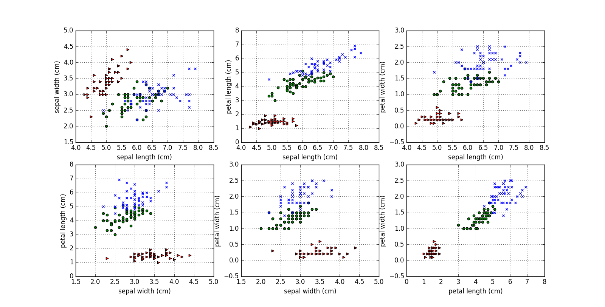
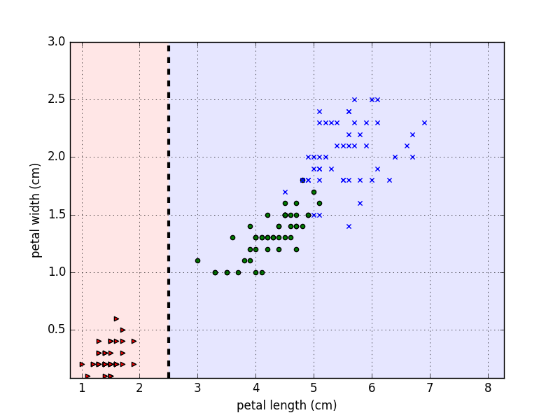
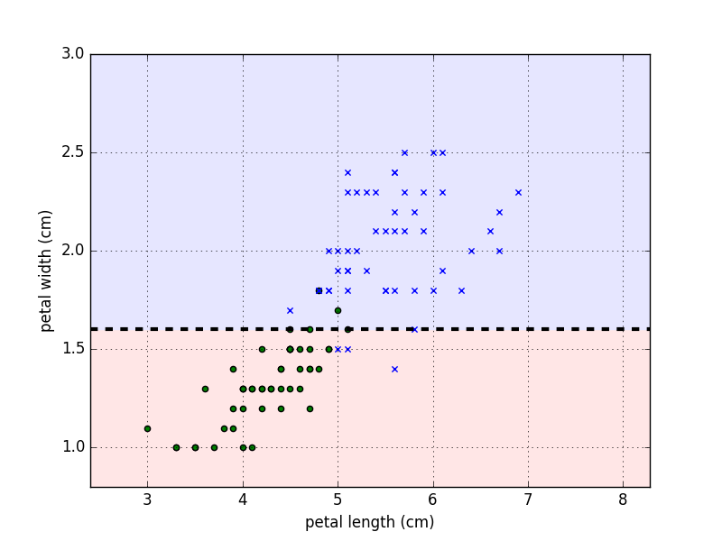

# Classification on Iris Dataset

## Scenario
- We have a classification problem on Iris dataset. 
- The data set contains 3 classes of 50 instances each, where each class refers to a type of iris plant.
- One class is linearly separable from the other 2; the latter are **NOT** linearly separable from each other.
- Use linear model.

## Analysis
- We can load the dataset from sklearn.dataset and look insdie:

    ```python
    from sklearn.datasets import load_iris
    data = load_iris()
    for k, v in data.items():
        print k
        print v, '\n'

    # output:
        target_names
        ['setosa' 'versicolor' 'virginica'] 
        
        data
        [[ 5.1  3.5  1.4  0.2]
         [ 4.9  3.   1.4  0.2]
         [ 4.7  3.2  1.3  0.2]
         [ 4.6  3.1  1.5  0.2]
         [ 5.   3.6  1.4  0.2]
         [ 5.4  3.9  1.7  0.4]
         [ 4.6  3.4  1.4  0.3]
         [ 5.   3.4  1.5  0.2],
         ...] 
        
        target
        [0 0 0 0 0 0 0 0 0 0 0 0 0 0 0 0 0 0 0 0 0 0 0 0 0 0 0 0 0 0 0 0 0 0 0 0 0
         0 0 0 0 0 0 0 0 0 0 0 0 0 1 1 1 1 1 1 1 1 1 1 1 1 1 1 1 1 1 1 1 1 1 1 1 1
         1 1 1 1 1 1 1 1 1 1 1 1 1 1 1 1 1 1 1 1 1 1 1 1 1 1 2 2 2 2 2 2 2 2 2 2 2
         2 2 2 2 2 2 2 2 2 2 2 2 2 2 2 2 2 2 2 2 2 2 2 2 2 2 2 2 2 2 2 2 2 2 2 2 2
         2 2] 
        
        DESCR
        Iris Plants Database
        
        Notes
        -----
        Data Set Characteristics:
            :Number of Instances: 150 (50 in each of three classes)
            :Number of Attributes: 4 numeric, predictive attributes and the class
            :Attribute Information:
                + sepal length in cm
                + sepal width in cm
                + petal length in cm
                + petal width in cm
                + class:
                        + Iris-Setosa
                        + Iris-Versicolour
                        + Iris-Virginica
            :Summary Statistics:
        
            ============== ==== ==== ======= ===== ====================
                            Min  Max   Mean    SD   Class Correlation
            ============== ==== ==== ======= ===== ====================
            sepal length:   4.3  7.9   5.84   0.83    0.7826
            sepal width:    2.0  4.4   3.05   0.43   -0.4194
            petal length:   1.0  6.9   3.76   1.76    0.9490  (high!)
            petal width:    0.1  2.5   1.20  0.76     0.9565  (high!)
            ============== ==== ==== ======= ===== ====================
        
            :Missing Attribute Values: None
            :Class Distribution: 33.3% for each of 3 classes.
            :Creator: R.A. Fisher
            :Donor: Michael Marshall (MARSHALL%PLU@io.arc.nasa.gov)
            :Date: July, 1988
        
        This is a copy of UCI ML iris datasets.
        http://archive.ics.uci.edu/ml/datasets/Iris
        
        The famous Iris database, first used by Sir R.A Fisher
        
        This is perhaps the best known database to be found in the
        pattern recognition literature.  Fisher's paper is a classic in the field and
        is referenced frequently to this day.  (See Duda & Hart, for example.)  The
        data set contains 3 classes of 50 instances each, where each class refers to a
        type of iris plant.  One class is linearly separable from the other 2; the
        latter are NOT linearly separable from each other.
        
        References
        ----------
           + Fisher,R.A. "The use of multiple measurements in taxonomic problems"
             Annual Eugenics, 7, Part II, 179-188 (1936); also in "Contributions to
             Mathematical Statistics" (John Wiley, NY, 1950).
           + Duda,R.O., & Hart,P.E. (1973) Pattern Classification and Scene Analysis.
             (Q327.D83) John Wiley & Sons.  ISBN 0-471-22361-1.  See page 218.
           + Dasarathy, B.V. (1980) "Nosing Around the Neighborhood: A New System
             Structure and Classification Rule for Recognition in Partially Exposed
             Environments".  IEEE Transactions on Pattern Analysis and Machine
             Intelligence, Vol. PAMI-2, No. 1, 67-71.
           + Gates, G.W. (1972) "The Reduced Nearest Neighbor Rule".  IEEE Transactions
             on Information Theory, May 1972, 431-433.
           + See also: 1988 MLC Proceedings, 54-64.  Cheeseman et al"s AUTOCLASS II
             conceptual clustering system finds 3 classes in the data.
           + Many, many more ...
        
        
        feature_names
        ['sepal length (cm)', 'sepal width (cm)', 'petal length (cm)', 'petal width (cm)'] 
    ```

- Since the dataset is small, let's do some visualization works:

    ```python
    import matplotlib.pyplot as plt
    from itertools import combinations
    featureNames = data['feature_names']
    features = data['data']
    targetNames = data['target_names']
    targets = data['target']

    plt.figure(figsize=(15, 10))
    styles = {0: 'r>', 1: 'go', 2: 'bx'}
    for f1, f2 in combinations(range(len(featureNames)), 2):
        plt.subplot(230+f2 if f1==0 else 231+f1+f2)
        plt.grid()
        plt.xlabel(featureNames[f1])
        plt.ylabel(featureNames[f2])
        for t in range(len(targetNames)):
            plt.scatter(features[targets==t, f1], features[targets==t, f2], marker=styles[t][1], c=styles[t][0])
    plt.show()
    ```

    

- Based on above figure, it turned out that according to some threshold on petal length we can easily identify Iris-Setosa, let's dig deeper on this:

    ```python
    labels = targetNames[targets]
    plen = features[:, 2]  # petal length
    is_setosa = (labels == 'setosa')
    print plen[is_setosa].max()  # 1.9
    print plen[~is_setosa].min()  # 3
    ```

- So we can use 2.5 as the seperate point, let's draw the decision doundary:

    ```python
    x0 = features[:, 2].min() * .8
    x1 = features[:, 2].max() * 1.2
    y0 = features[:, 3].min() * .8  # petal width
    y1 = features[:, 3].max() * 1.2
    plt.figure()
    plt.grid()
    plt.xlabel(featureNames[2])
    plt.ylabel(featureNames[3])
    plt.fill_between([x0, 2.5], [y0, y0], [y1, y1], color=(1, .9, .9))
    plt.fill_between([2.5, x1], [y0, y0], [y1, y1], color=(.9, .9, 1))
    plt.plot([2.5, 2.5], [y0, y1], 'k--', lw=3)
    for t in range(len(targetNames)):
        plt.scatter(features[targets==t, 2], features[targets==t, 3], marker=styles[t][1], c=styles[t][0])
    plt.xlim(x0, x1)
    plt.ylim(y0, y1)
    plt.show()
    ```

    

- We sperate one class perfectly, and now we move on to the rest 2 classes, since there is clearly no perfect line can seperate them, we have to brute-force:

    ```python
    features = features[~is_setosa]
    labels = labels[~is_setosa]
    is_virginica = (labels == 'virginica')

    def fit_model(features, labels):
        bestThres = 0
        bestAcc = -1
        bestF = 0
        rev = False
        for f in range(features.shape[1]):
            for t in features[:, f]:
                pred = (features[:, f] > t)
                acc = (pred == labels).mean()
                if acc > bestAcc or 1 - acc > bestAcc:
                    bestThres = t
                    bestAcc = max(acc, 1 - acc)
                    bestF = f
                    rev = bestAcc == 1 - acc
        return bestThres, bestF, rev

    model = fit_model(features, is_virginica)
    print model[0], model[1], featureNames[model[2]]
    # output: 1.6 0.94 petal width (cm)
    ```

- After brute-force, we can see that if we seperate the rest 2 classes by 1.6 of the petal width, we can achieve 94% training accuracy. Let's visualise the desicion boundary:

    ```python
    x0 = features[:, 2].min() * .8
    x1 = features[:, 2].max() * 1.2
    y0 = features[:, 3].min() * .8
    y1 = features[:, 3].max() * 1.2
    targets = targets[~is_setosa]
    plt.figure()
    plt.grid()
    plt.xlabel(featureNames[2])
    plt.ylabel(featureNames[3])
    plt.fill_between([x0, x1], [1.6, 1.6], [y0, y0], color=(1, .9, .9))
    plt.fill_between([x0, x1], [1.6, 1.6], [y1, y1], color=(.9, .9, 1))
    plt.plot([x0, x1], [1.6, 1.6], 'k--', lw=3)
    for t in range(len(targetNames)):
        plt.scatter(features[targets==t, 2], features[targets==t, 3], marker=styles[t][1], c=styles[t][0])
    plt.xlim(x0, x1)
    plt.ylim(y0, y1)
    plt.show()
    ```

    

- Finally we get our model by chaining the binary models, first we examine if petal length < 2.5 to see check if it is setosa. If yes, we are done, otherwise we examine if petal width < 1.6. The model can achieve 94% training accuracy. Let's check the result of cross validation:

    ```python
    from sklearn.cross_validation import KFold


    def predict(model, features):
        t, f, rev = model
        return features[:, f] > t if not rev else features[:, f] <= t


    def accuracy(features, labels, model):
        return (predict(model, features) == labels).mean()

    for train, test in KFold(features.shape[0], 5, True):
        model = fit_model(features[train], is_virginica[train])
        print 'train acc:', accuracy(features[train], is_virginica[train], model),
        print 'test acc:', accuracy(features[test], is_virginica[test], model)

    #output:
    train acc: 0.95 test acc: 0.85
    train acc: 0.95 test acc: 0.8
    train acc: 0.9375 test acc: 0.9
    train acc: 0.9625 test acc: 0.85
    train acc: 0.925 test acc: 1.0
    ```

- [complete solution py](./solution.py)
