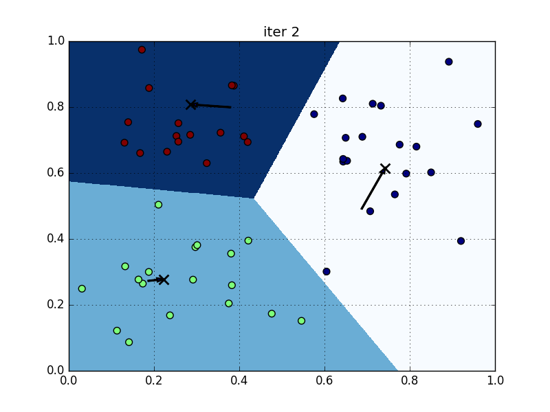
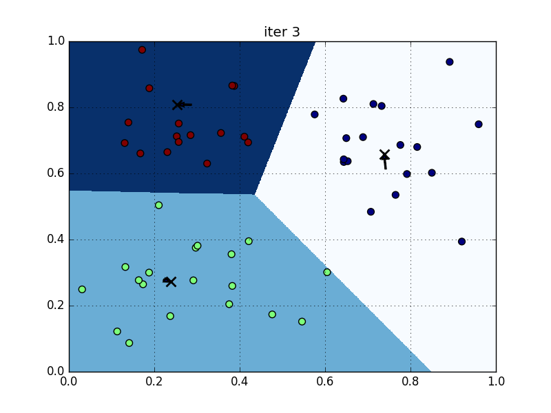
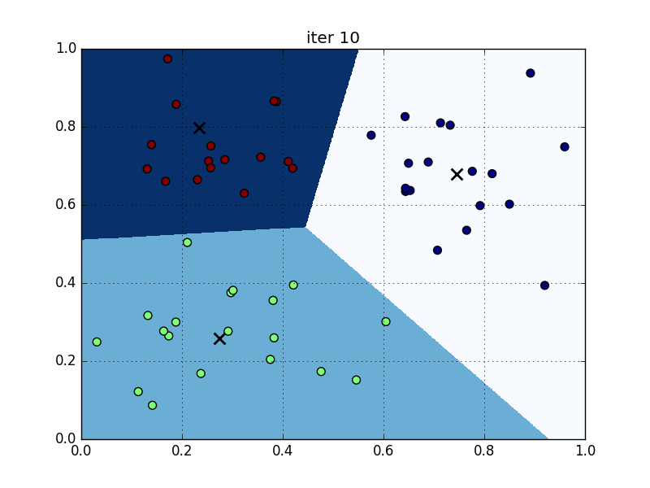

# Clustering Related Posts

## Scenario
- We are implementing a stackoverflow-like search engine,
- When a user comes in and type in a question, how can we find the related posts in our training data?

## Analysis
- Notes on [supervised learning](https://en.wikipedia.org/wiki/Supervised_learning) and [unsupervised learning](https://en.wikipedia.org/wiki/Unsupervised_learning).

- Measuring relateness among posts
    + [Edit distance](https://en.wikipedia.org/wiki/Edit_distance), measures the minimum required operations (insert/replace/delete) on characters to tranfrom one word into the other, e.g. the edit distance of "cat" and "act" is 2, delete "c" then insert "c". The same concept applies to posts, the edit distance among posts can be calculated the minimum required operations on words, instead of characters. Major drawback: Not taking words order into account.

    + [Bag of words](https://en.wikipedia.org/wiki/Bag-of-words_model), example:
    > Two samples:
    > 
    > (1) John likes to watch movies. Mary likes movies too.
    >
    > (2) John also likes to watch football games.
    > 
    > Unique words Occurred:
    > 
    > [
    >     "John",
    >     "likes",
    >     "to",
    >     "watch",
    >     "movies",
    >     "also",
    >     "football",
    >     "games",
    >     "Mary",
    >     "too"
    > ]
    > 
    > Count occurrences accordingly (_vectorization_):
    > 
    > (1) [1, 2, 1, 1, 2, 0, 0, 0, 1, 1]
    >
    > (2) [1, 1, 1, 1, 0, 1, 1, 1, 0, 0]
    
    + Converting raw texts into bag-of-words model using [CountVectorizer](http://scikit-learn.org/stable/modules/generated/sklearn.feature_extraction.text.CountVectorizer.html) in sklearn:

    ```python
    from sklearn.feature_extraction.text import CountVectorizer
    vectorizer = CountVectorizer()
    print vectorizer
    # output:
    CountVectorizer(analyzer=u'word', binary=False, decode_error=u'strict',
            dtype=<type 'numpy.int64'>, encoding=u'utf-8', input=u'content',
            lowercase=True, max_df=1.0, max_features=None, min_df=1,
            ngram_range=(1, 1), preprocessor=None, stop_words=None,
            strip_accents=None, token_pattern=u'(?u)\\b\\w\\w+\\b',
            tokenizer=None, vocabulary=None)
    ```

    + Feed sample data then start vectorize:

    ```python
    content = ["How to format my hard disk", " Hard disk format problems "]
    X = vectorizer.fit_transform(content)
    print vectorizer.get_feature_names()
    # output: [u'disk', u'format', u'hard', u'how', u'my', u'problems', u'to']
    print X.toarray().T
    # output:
    [[1 1]
     [1 1]
     [1 1]
     [1 0]
     [1 0]
     [0 1]
     [1 0]]
    ```

    + Toy dataset:
    
    | Post # | Content |
    |:---:|---|
    | 0 | This is a toy post about machine learning. Actually, it contains not much interesting stuff. |
    | 1 | Imaging databases can get huge. |
    | 2 | Most imaging databases save images permanently. |
    | 3 | Imaging databases store images. |
    | 4 | Imaging databases store images. Imaging databases store images. Imaging databases store images. |

    ```python
    corpus = [
        "This is a toy post about machine learning. Actually, it contains not much interesting stuff.",
        "Imaging databases can get huge.",
        "Most imaging databases save images permanently.",
        "Imaging databases store images.",
        "Imaging databases store images. Imaging databases store images. Imaging databases store images."
    ]
    X_train = vectorizer.fit_transform(corpus)
    print vectorizer.get_feature_names()
    print X_train.toarray().T
    # output:
    [u'about', u'actually', u'can', u'contains', u'databases', u'get', u'huge', u'images', u'imaging', u'interesting', u'is', u'it', u'learning', u'machine', u'most', u'much', u'not', u'permanently', u'post', u'save', u'store', u'stuff', u'this', u'toy']
    [[1 0 0 0 0]
     [1 0 0 0 0]
     [0 1 0 0 0]
     [1 0 0 0 0]
     [0 1 1 1 3]
     [0 1 0 0 0]
     [0 1 0 0 0]
     [0 0 1 1 3]
     [0 1 1 1 3]
     [1 0 0 0 0]
     [1 0 0 0 0]
     [1 0 0 0 0]
     [1 0 0 0 0]
     [1 0 0 0 0]
     [0 0 1 0 0]
     [1 0 0 0 0]
     [1 0 0 0 0]
     [0 0 1 0 0]
     [1 0 0 0 0]
     [0 0 1 0 0]
     [0 0 0 1 3]
     [1 0 0 0 0]
     [1 0 0 0 0]
     [1 0 0 0 0]]
    ```

    + Let's mimic a user input, say he wants to search "imaging databases": 

    ```python
    newPost = 'imaging databases'
    newVec = vectorizer.transform([newPost])
    print newVec


    def dist(v1, v2):
        # return euclidean distance
        return sp.linalg.norm((v1 - v2).toarray())

    minI, minDist = 0, 1e10
    for i in range(X_train.shape[0]):
        d = dist(X_train[i, :], newVec)
        print i, d
        if d < minDist:
            minDist = d
            minI = i
    print 'most related', minI, minDist
    # output:
      (0, 4)    1
      (0, 8)    1
    0 4.0
    1 1.73205080757
    2 2.0
    3 1.41421356237
    4 5.09901951359
    most related 3 1.41421356237
    ```

    + As the result stated that post #3 has the highest similarity with our target vector, but we can see that post #4 is actually the same as post #3, only duplicates 2 more times, so we would like to see they have the same similarities. We can do that using normalization:

    ```python
    def dist_norm(v1, v2):
        v1_normed = v1 / sp.linalg.norm(v1.toarray())
        v2_normed = v2 / sp.linalg.norm(v2.toarray())
        return sp.linalg.norm((v1_normed - v2_normed).toarray())

    minI, minDist = 0, 1e10
    for i in range(X_train.shape[0]):
        d = dist_norm(X_train[i, :], newVec)
        print i, d
        if d < minDist:
            minDist = d
            minI = i
    print 'most related', minI, minDist
    # output:
    0 1.41421356237
    1 0.857373276894
    2 0.919401686762
    3 0.76536686473
    4 0.76536686473
    most related 3 0.76536686473
    ```

    + Filter stop words. Stop words are those words can be seen in any context and carry little information about the subject, like 'about', 'after', 'a', 'in'. We should ignore those stop words and change our previous code a bit:

    ```python
    # vectorizer = CountVectorizer()
    vectorizer = CountVectorizer(stop_words='english')
    ...
    print vectorizer.get_feature_names()
    # output:
    [u'actually', u'contains', u'databases', u'huge', u'images', u'imaging', u'interesting', u'learning', u'machine', u'permanently', u'post', u'save', u'store', u'stuff', u'toy']
    ...

    # after this change, the last output:
    0 1.41421356237
    1 0.605810893055
    2 0.857373276894
    3 0.76536686473
    4 0.76536686473
    most related 1 0.605810893055
    ```

    + After filtering stop words, the most related post changed to post #1. If we look closely, we can find that the vector length of post #1 and post #3 is different and clearly our current similarity calculation favors shorter:

    ```python
    print X_train[1,:]
    print
    print X_train[3,:]
    # output:
      (0, 5)    1
      (0, 2)    1
      (0, 3)    1

      (0, 5)    1
      (0, 2)    1
      (0, 4)    1
      (0, 12)   1
    ```

    + Stemming. One important thing we are still missing here, we take words in different variants as different words. In our example, we should consider 'image' and 'imaging' as the same, and the stemmers are not build-in within sklearn, but we can integrate them from [nltk](http://www.nltk.org):

    ```python
    import nltk.stem
    stemmer = nltk.stem.SnowballStemmer('english')
    print stemmer.stem("image")  # imag
    print stemmer.stem("images")  # imag
    print stemmer.stem("imaging")  # imag
    print stemmer.stem("imagination")  # imagin
    ```

    + We can integrate the stemmer into CountVectorizer by inheritance:

    ```python
    stemmer = nltk.stem.SnowballStemmer('english')


    class StemmedCountVectorizer(CountVectorizer):
        def build_analyzer(self):
            analyzer = super(StemmedCountVectorizer, self).build_analyzer()
            return lambda doc: (stemmer.stem(w) for w in analyzer(doc))

    # vectorizer = CountVectorizer()
    # vectorizer = CountVectorizer(stop_words='english')
    vectorizer = StemmedCountVectorizer(stop_words='english')
    ...
    print vectorizer.get_feature_names()
    # output:
    [u'actual', u'contain', u'databas', u'huge', u'imag', u'interest', u'learn', u'machin', u'perman', u'post', u'save', u'store', u'stuff', u'toy']
    ...
    # last similarities comparison:
    0 1.41421356237
    1 0.605810893055
    2 0.629628897467
    3 0.517638090205
    4 0.517638090205
    most related 3 0.517638090205
    ```

    + What we have been doing so far are based on an implicit assumption, the more occurrences of a word, the more important it is in our similarity context. This is not always true, words that occur in all posts are undoubtedly carry less information than words that only occur in some posts. We can not just weight the importance of word by counting, the number of posts with that word should also be taken into account, that's what we called [TF/IDF](https://en.wikipedia.org/wiki/Tf–idf):

    ```python
    def tfidf(word, post, corpus):
        tf = post.count(word) * 1.0 / len(post)
        numPosts = len([p for p in corpus if word in p])
        idf = sp.log2(len(corpus) * 1.0 / numPosts)
        return tf * idf

    a, abb, abc = ['a'], ['a', 'b', 'b'], ['a', 'b', 'c']
    corpus = [a, abb, abc]
    print tfidf('a', a, corpus)  # 0.0
    print tfidf('b', abb, corpus)  # 0.389975000481
    print tfidf('c', abc, corpus)  # 0.528320833574
    ```

    + Apply TF/IDF to our previous code with stemmer:

    ```python
    from sklearn.feature_extraction.text import CountVectorizer, TfidfVectorizer

    class StemmedTfidfVectorizer(TfidfVectorizer):
        def build_analyzer(self):
            analyzer = super(StemmedTfidfVectorizer, self).build_analyzer()
            return lambda doc: (stemmer.stem(w) for w in analyzer(doc))

    # vectorizer = CountVectorizer()
    # vectorizer = CountVectorizer(stop_words='english')
    # vectorizer = StemmedCountVectorizer(stop_words='english')
    vectorizer = StemmedTfidfVectorizer(stop_words='english')
    ...
    # output for last similarities comparison:
    0 1.41421356237
    1 0.86816970529
    2 0.859044512133
    3 0.634205801304
    4 0.634205801304
    most related 3 0.634205801304
    ```

    + Achievements so far
        * tokenizing
        * normalizing
        * stop word filtering
        * stemming
        * TF/IDF weighting

    + Major drawbacks so far
        * ignores word relations, e.g. "A hates B" and "B hates A" have the same feature vector.
        * fails to caputure negations, e.g. "I have money" and "I have no money" have similar feature vector.
        * fails to misspelled words clearly.
        * But it is good enough to move on to clustering;)

    + Clustering
        * [Flat clustering](http://nlp.stanford.edu/IR-book/html/htmledition/flat-clustering-1.html)
        * [hierarchical clustering](https://en.wikipedia.org/wiki/Hierarchical_clustering)
        * [overview of clustering algorithms in sklearn](http://scikit-learn.org/dev/modules/clustering.html)
        * Basic K-means clustering example:

        ```python
        import scipy as sp
        from scipy.stats import norm
        import matplotlib.pyplot as plt
        from sklearn.cluster import KMeans

        seed = 2
        sp.random.seed(seed)  # to reproduce the data later on

        numClusters = 3

        xw1 = norm(loc=.3, scale=.15).rvs(20)
        yw1 = norm(loc=.3, scale=.15).rvs(20)

        xw2 = norm(loc=.7, scale=.15).rvs(20)
        yw2 = norm(loc=.7, scale=.15).rvs(20)

        xw3 = norm(loc=.2, scale=.15).rvs(20)
        yw3 = norm(loc=.8, scale=.15).rvs(20)

        x = sp.append(sp.append(xw1, xw2), xw3)
        y = sp.append(sp.append(yw1, yw2), yw3)


        def plot(x, y, title, km=None):
            if km:
                plt.scatter(x, y, s=50, c=km.predict(sp.vstack((x, y)).T))
            else:
                plt.scatter(x, y, s=50)
            plt.title(title)
            plt.autoscale(tight=True)
            plt.grid()
            plt.xlim(0, 1)
            plt.ylim(0, 1)

        plot(x, y, 'vectors')
        plt.savefig('./pics/figure1.png')
        plt.clf()
        ```

        

        * Visualize the boundary and centers after 1st iteration:

        ```python
        def plot_kmean_iter(i):
            km = KMeans(init='random', n_clusters=numClusters, verbose=1,
                        n_init=1, max_iter=i,
                        random_state=seed)
            km.fit(features)
            plot(x, y, 'iter %d' % i, km)
            mx, my = sp.meshgrid(sp.arange(0, 1, 0.001), sp.arange(0, 1, 0.001))
            Z = km.predict(sp.vstack((mx.ravel(), my.ravel())).T).reshape(mx.shape)
            plt.imshow(Z, interpolation='nearest',
                         extent=(mx.min(), mx.max(), my.min(), my.max()),
                         cmap=plt.cm.Blues,
                         aspect='auto', origin='lower')
            plt.scatter(km.cluster_centers_[:, 0], km.cluster_centers_[:, 1],
                          marker='x', linewidth=2, s=100, color='black')
            return km.cluster_centers_

        features = sp.vstack((x, y)).T

        centers1 = plot_kmean_iter(1)
        plt.savefig('./pics/figure2.png')
        plt.clf()
        ```

        

        * Let's try more iterations and see how the centers change:

        ```python
        def plot_arrow(centers1, centers2):
            for i in range(centers1.shape[0]):
                x1, y1 = centers1[i, :]
                x2, y2 = centers2[i, :]
                plt.arrow(x1, y1, x2 - x1, y2 - y1, length_includes_head=True, head_width=.01, lw=2)

        centers2 = plot_kmean_iter(2)
        plot_arrow(centers1, centers2)
        plt.savefig('./pics/figure3.png')
        plt.clf()

        centers3 = plot_kmean_iter(3)
        plot_arrow(centers2, centers3)
        plt.savefig('./pics/figure4.png')
        plt.clf()

        centers3 = plot_kmean_iter(10)
        plt.savefig('./pics/figure5.png')
        plt.clf()
        # although we set 10 iterations here, the centers get converged at iteration 4
        ```

        

        

        

    + Real world example, as we get new weapons, let's get our hands dirty to apply those techniques to real world example, [the 20newsgroup dataset](http://qwone.com/~jason/20Newsgroups/). We can download it from [here](http://qwone.com/~jason/20Newsgroups/20news-bydate.tar.gz).

        _The 20 Newsgroups data set is a collection of approximately 20,000 newsgroup documents, partitioned (nearly) evenly across 20 different  newsgroups. To the best of my knowledge, it was originally collected  by Ken Lang, probably for his Newsweeder: Learning to filter netnews paper, though he does not explicitly mention this collection. The 20 newsgroups collection has become a popular data set for experiments in text applications of machine learning techniques, such as text classification and text clustering._

        ```python
        import os
        from itertools import count
        import scipy as sp
        from sklearn.feature_extraction.text import TfidfVectorizer
        import nltk.stem
        from sklearn.cluster import KMeans

        stemmer = nltk.stem.SnowballStemmer('english')


        class StemmedTfidfVectorizer(TfidfVectorizer):
            def build_analyzer(self):
                analyzer = super(StemmedTfidfVectorizer, self).build_analyzer()
                return lambda doc: (stemmer.stem(w) for w in analyzer(doc))

        # assume uncompressed the dataset under data folder
        trainDir = './data/20news-bydate-train'
        testDir = './data/20news-bydate-test'

        # filter some topics to speedup the process, just for illustration purpose
        groups = set(['comp.graphics', 'comp.os.ms-windows.misc', 'comp.sys.ibm.pc.hardware', 'comp.sys.mac.hardware', 'comp.windows.x', 'sci.space'])


        def load_20_news_groups(d):
            data = []
            target_names = []
            filenames = []
            for parent, folder, files in os.walk(d):
                target_name = os.path.split(parent)[-1]
                if target_name not in groups:
                    continue
                for f in files:
                    fullFileName = os.path.join(parent, f)
                    data.append(open(fullFileName).read())
                    target_names.append(target_name)
                    filenames.append(fullFileName)
            return {'data': data, 'target_names': target_names, 'filenames': filenames}

        trainData = load_20_news_groups(trainDir)
        print len(trainData['filenames'])  # 3529
        testData = load_20_news_groups(testDir)
        print len(testData['filenames'])  # 4713

        # ignore decode_error or you will get errors, it is real world dirty data
        vectorizer = StemmedTfidfVectorizer(min_df=10, max_df=0.5, stop_words='english', decode_error='ignore')
        trainMat = vectorizer.fit_transform(trainData['data'])
        print trainMat.shape  # (3529, 4713)

        numClusters = 50
        # fix random_state for reproducing the same result
        # verbose=1 to output internal stats
        km = KMeans(n_clusters=numClusters, n_init=1, verbose=1, random_state=3)
        km.fit(trainMat)
        # Initialization complete
        # Iteration  0, inertia 5712.205
        # Iteration  1, inertia 3177.684
        # Iteration  2, inertia 3143.802
        # Iteration  3, inertia 3126.457
        # Iteration  4, inertia 3118.120
        # Iteration  5, inertia 3112.724
        # Iteration  6, inertia 3109.045
        # Iteration  7, inertia 3107.433
        # Iteration  8, inertia 3106.019
        # Iteration  9, inertia 3104.404
        # Iteration 10, inertia 3103.578
        # Iteration 11, inertia 3103.142
        # Iteration 12, inertia 3102.692
        # Iteration 13, inertia 3101.949
        # Iteration 14, inertia 3101.598
        # Iteration 15, inertia 3101.299
        # Iteration 16, inertia 3100.663
        # Iteration 17, inertia 3100.291
        # Iteration 18, inertia 3100.173
        # Iteration 19, inertia 3100.120
        # Converged at iteration 19

        newPost = '''
        "Disk drive problems.
            Hi, I have a problem with my hard disk. After 1 year it is working only sporadically now.
            I tried to format it, but now it doesn't boot any more.
            Any ideas? Thanks."
        '''

        newPostVec = vectorizer.transform([newPost])
        newPostLabel = km.predict(newPostVec)[0]
        print newPostLabel  # 12
        candidateIndices = (km.labels_ == newPostLabel).nonzero()[0]
        print len(candidateIndices)  # 117
        dists = sp.zeros_like(candidateIndices, dtype=sp.float32)
        for i, idx in enumerate(candidateIndices):
            dists[i] = sp.linalg.norm((newPostVec - trainMat[idx, :]).toarray())
        sortedIndices = sp.argsort(dists)

        print trainData['data'][candidateIndices[sortedIndices[0]]]
        print '-' * 30

        print trainData['data'][candidateIndices[sortedIndices[20]]]
        print '-' * 30

        print trainData['data'][candidateIndices[sortedIndices[50]]]
        print '-' * 30
        ```

        **top 1st similar post**:

        > From: Thomas Dachsel <GERTHD@mvs.sas.com>
        > Subject: BOOT PROBLEM with IDE controller
        > Nntp-Posting-Host: sdcmvs.mvs.sas.com
        > Organization: SAS Institute Inc.
        > Lines: 25
        > 
        > Hi,
        > I've got a Multi I/O card (IDE controller + serial/parallel
        > interface) and two floppy drives (5 1/4, 3 1/2) and a
        > Quantum ProDrive 80AT connected to it.
        > I was able to format the hard disk, but I could not boot from
        > it. I can boot from drive A: (which disk drive does not matter)
        > but if I remove the disk from drive A and press the reset switch,
        > the LED of drive A: continues to glow, and the hard disk is
        > not accessed at all.
        > I guess this must be a problem of either the Multi I/o card
        > or floppy disk drive settings (jumper configuration?)
        > Does someone have any hint what could be the reason for it.
        > Please reply by email to GERTHD@MVS.SAS.COM
        > Thanks,
        > Thomas
        > +-------------------------------------------------------------------+
        > | Thomas Dachsel                                                    |
        > | Internet: GERTHD@MVS.SAS.COM                                      |
        > | Fidonet:  Thomas_Dachsel@camel.fido.de (2:247/40)                 |
        > | Subnet:   dachsel@rnivh.rni.sub.org (UUCP in Germany, now active) |
        > | Phone:    +49 6221 4150 (work), +49 6203 12274 (home)             |
        > | Fax:      +49 6221 415101                                         |
        > | Snail:    SAS Institute GmbH, P.O.Box 105307, D-W-6900 Heidelberg |
        > | Tagline:  One bad sector can ruin a whole day...                  |
        > +-------------------------------------------------------------------+

        **top 20th similar post**:

        > From: ah301@yfn.ysu.edu (Jerry Sy)
        > Subject: how to boot from ext HD on power on ?
        > Organization: St. Elizabeth Hospital, Youngstown, OH
        > Lines: 12
        > Reply-To: ah301@yfn.ysu.edu (Jerry Sy)
        > NNTP-Posting-Host: yfn.ysu.edu
        > 
        > 
        > I have an external hard drive I wish to use as startup disk.
        > problem is, when I switch on the mac, it boots on the internal HD,
        > but when I restart  (warm boot) the mac, it boots from the external.
        > how do I make  it boot directly from the external ?
        > 
        > please email replies if possible.
        > 
        > thanks in advance.
        > 
        > jerry
        > 

        **top 50th similar post**:

        > From: ehung@ampex.com (Eric Hung)
        > Subject: Re: HELP! Installing second IDE drive
        > Nntp-Posting-Host: dct3
        > Organization: Ampex Corporation, Redwood City CA
        > Lines: 37
        > 
        > >
        > >>Another possibility is that the 85MB one is already partitioned into
        > >>two seperate drives, C and D, and the CMOS asks for "C: drive" and "D:
        > >>drive" setup info rather than "drive 1" and "drive 2" like most others
        > >>I've seen.  Could this be confusing things?
        > >
        > >>So, I need HELP!  The drive came bereft of any docs, except for some
        > >>info for the CMOS setup; the controller has a little piece of paper
        > >>about the size of an index card; I cannibalized the cable (it's one
        > >>of those with a connector at each end and the one in the middle, so
        > >>it looks like a serial connection); now I be lost!
        > >
        > >>Many, many thanks in advance!  This is practically an emergency (I have
        > >>two papers to do on this thing for Monday!)!  Help!
        > >>-- 
        > >>-----------------------
        > >>William Barnes         SURAnet Operations
        > >>wbarnes@sura.net       (301) 982-4600 voice  (301) 982-4605 fax
        > >>Disclaimer:  I don't speak for SURAnet and they don't speak for me.
        > >I've been told by our local computer guru that you can't do this unless you 
        > >perform a low level format on your existing hard drive and set your system 
        > >up for two hard drives from the beginning.  I took him at his word, and I 
        > >have not tried to find out any more about it, because I'm not going to back 
        > >everything up just to add another HDD.  If anyone knows for sure what the 
        > >scoop is, I would like to know also.  Thanks in advance also.
        > >
        > >Bill Willis
        > >
        > 
        > 
        > If you bought your IDE drive from a dealer, you shouldn 't have to 
        > perform a low level format. Even if the 1st HD is already partitioned
        > into C and D, FDISK will automatically assign the 2 nd HD to D and 
        > change the 2nd partition of 1st drive to E.
        > 
        > Check the jumper settings and CMOS setup, in particular the correct
        > number of cylinders and tracks
