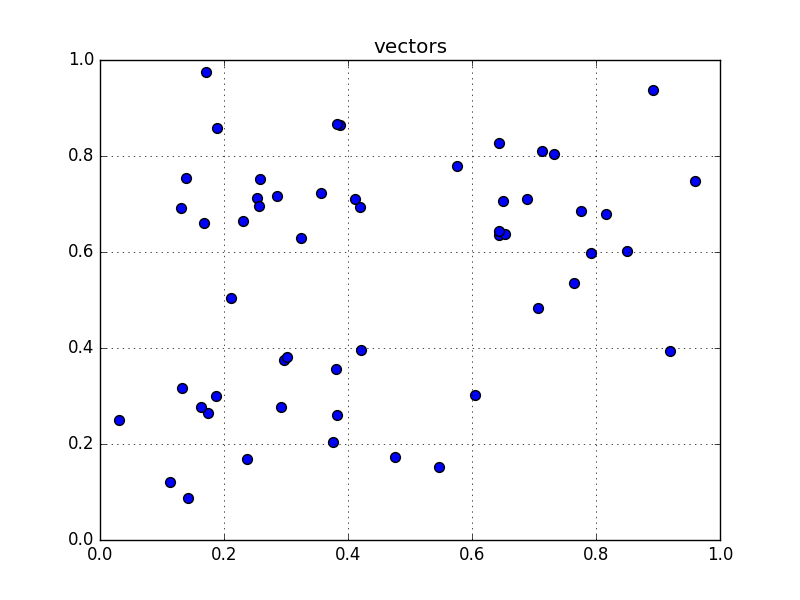
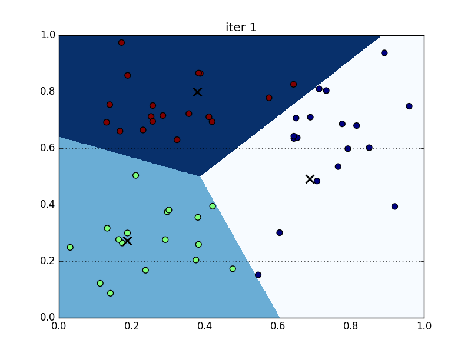

# Clustering Related Posts

## Scenario
- We are implementing a search engine,
- When a user comes in and type in some keywords, how can we find the related posts in our training data?

## Analysis
- Notes on [supervised learning](https://en.wikipedia.org/wiki/Supervised_learning) and [unsupervised learning](https://en.wikipedia.org/wiki/Unsupervised_learning).

- Measuring relateness among posts
    + [Edit distance](https://en.wikipedia.org/wiki/Edit_distance), measures the minimum required operations (insert/replace/delete) on characters to tranfrom one word into the other, e.g. the edit distance of "cat" and "act" is 2, delete "c" then insert "c". The same concept applies to posts, the edit distance among posts can be calculated the minimum required operations on words, instead of characters. Major drawback: Not taking words order into account.

    + [Bag of words](https://en.wikipedia.org/wiki/Bag-of-words_model), example:
    > Two samples:
    > 
    > (1) John likes to watch movies. Mary likes movies too.
    >
    > (2) John also likes to watch football games.
    > 
    > Unique words Occurred:
    > 
    > [
    >     "John",
    >     "likes",
    >     "to",
    >     "watch",
    >     "movies",
    >     "also",
    >     "football",
    >     "games",
    >     "Mary",
    >     "too"
    > ]
    > 
    > Count occurrences accordingly (_vectorization_):
    > 
    > (1) [1, 2, 1, 1, 2, 0, 0, 0, 1, 1]
    >
    > (2) [1, 1, 1, 1, 0, 1, 1, 1, 0, 0]
    
    + Converting raw texts into bag-of-words model using [CountVectorizer](http://scikit-learn.org/stable/modules/generated/sklearn.feature_extraction.text.CountVectorizer.html) in sklearn:

    ```python
    from sklearn.feature_extraction.text import CountVectorizer
    vectorizer = CountVectorizer()
    print vectorizer
    # output:
    CountVectorizer(analyzer=u'word', binary=False, decode_error=u'strict',
            dtype=<type 'numpy.int64'>, encoding=u'utf-8', input=u'content',
            lowercase=True, max_df=1.0, max_features=None, min_df=1,
            ngram_range=(1, 1), preprocessor=None, stop_words=None,
            strip_accents=None, token_pattern=u'(?u)\\b\\w\\w+\\b',
            tokenizer=None, vocabulary=None)
    ```

    + Feed sample data then start vectorize:

    ```python
    content = ["How to format my hard disk", " Hard disk format problems "]
    X = vectorizer.fit_transform(content)
    print vectorizer.get_feature_names()
    # output: [u'disk', u'format', u'hard', u'how', u'my', u'problems', u'to']
    print X.toarray().T
    # output:
    [[1 1]
     [1 1]
     [1 1]
     [1 0]
     [1 0]
     [0 1]
     [1 0]]
    ```

    + Toy dataset:
    
    | Post # | Content |
    |:---:|---|
    | 0 | This is a toy post about machine learning. Actually, it contains not much interesting stuff. |
    | 1 | Imaging databases can get huge. |
    | 2 | Most imaging databases save images permanently. |
    | 3 | Imaging databases store images. |
    | 4 | Imaging databases store images. Imaging databases store images. Imaging databases store images. |

    ```python
    corpus = [
        "This is a toy post about machine learning. Actually, it contains not much interesting stuff.",
        "Imaging databases can get huge.",
        "Most imaging databases save images permanently.",
        "Imaging databases store images.",
        "Imaging databases store images. Imaging databases store images. Imaging databases store images."
    ]
    X_train = vectorizer.fit_transform(corpus)
    print vectorizer.get_feature_names()
    print X_train.toarray().T
    # output:
    [u'about', u'actually', u'can', u'contains', u'databases', u'get', u'huge', u'images', u'imaging', u'interesting', u'is', u'it', u'learning', u'machine', u'most', u'much', u'not', u'permanently', u'post', u'save', u'store', u'stuff', u'this', u'toy']
    [[1 0 0 0 0]
     [1 0 0 0 0]
     [0 1 0 0 0]
     [1 0 0 0 0]
     [0 1 1 1 3]
     [0 1 0 0 0]
     [0 1 0 0 0]
     [0 0 1 1 3]
     [0 1 1 1 3]
     [1 0 0 0 0]
     [1 0 0 0 0]
     [1 0 0 0 0]
     [1 0 0 0 0]
     [1 0 0 0 0]
     [0 0 1 0 0]
     [1 0 0 0 0]
     [1 0 0 0 0]
     [0 0 1 0 0]
     [1 0 0 0 0]
     [0 0 1 0 0]
     [0 0 0 1 3]
     [1 0 0 0 0]
     [1 0 0 0 0]
     [1 0 0 0 0]]
    ```

    + Let's mimic a user input, say he wants to search "imaging databases": 

    ```python
    newPost = 'imaging databases'
    newVec = vectorizer.transform([newPost])
    print newVec


    def dist(v1, v2):
        # return euclidean distance
        return sp.linalg.norm((v1 - v2).toarray())

    minI, minDist = 0, 1e10
    for i in range(X_train.shape[0]):
        d = dist(X_train[i, :], newVec)
        print i, d
        if d < minDist:
            minDist = d
            minI = i
    print 'most related', minI, minDist
    # output:
      (0, 4)    1
      (0, 8)    1
    0 4.0
    1 1.73205080757
    2 2.0
    3 1.41421356237
    4 5.09901951359
    most related 3 1.41421356237
    ```

    + As the result stated that post #3 has the highest similarity with our target vector, but we can see that post #4 is actually the same as post #3, only duplicates 2 more times, so we would like to see they have the same similarities. We can do that using normalization:

    ```python
    def dist_norm(v1, v2):
        v1_normed = v1 / sp.linalg.norm(v1.toarray())
        v2_normed = v2 / sp.linalg.norm(v2.toarray())
        return sp.linalg.norm((v1_normed - v2_normed).toarray())

    minI, minDist = 0, 1e10
    for i in range(X_train.shape[0]):
        d = dist_norm(X_train[i, :], newVec)
        print i, d
        if d < minDist:
            minDist = d
            minI = i
    print 'most related', minI, minDist
    # output:
    0 1.41421356237
    1 0.857373276894
    2 0.919401686762
    3 0.76536686473
    4 0.76536686473
    most related 3 0.76536686473
    ```

    + Filter stop words. Stop words are those words can be seen in any context and carry little information about the subject, like 'about', 'after', 'a', 'in'. We should ignore those stop words and change our previous code a bit:

    ```python
    # vectorizer = CountVectorizer()
    vectorizer = CountVectorizer(stop_words='english')
    ...
    print vectorizer.get_feature_names()
    # output:
    [u'actually', u'contains', u'databases', u'huge', u'images', u'imaging', u'interesting', u'learning', u'machine', u'permanently', u'post', u'save', u'store', u'stuff', u'toy']
    ...

    # after this change, the last output:
    0 1.41421356237
    1 0.605810893055
    2 0.857373276894
    3 0.76536686473
    4 0.76536686473
    most related 1 0.605810893055
    ```

    + After filtering stop words, the most related post changed to post #1. If we look closely, we can find that the vector length of post #1 and post #3 is different and clearly our current similarity calculation favors shorter:

    ```python
    print X_train[1,:]
    print
    print X_train[3,:]
    # output:
      (0, 5)    1
      (0, 2)    1
      (0, 3)    1

      (0, 5)    1
      (0, 2)    1
      (0, 4)    1
      (0, 12)   1
    ```

    + Stemming. One important thing we are still missing here, we take words in different variants as different words. In our example, we should consider 'image' and 'imaging' as the same, and the stemmers are not build-in within sklearn, but we can integrate them from [nltk](http://www.nltk.org):

    ```python
    import nltk.stem
    stemmer = nltk.stem.SnowballStemmer('english')
    print stemmer.stem("image")  # imag
    print stemmer.stem("images")  # imag
    print stemmer.stem("imaging")  # imag
    print stemmer.stem("imagination")  # imagin
    ```

    + We can integrate the stemmer into CountVectorizer by inheritance:

    ```python
    stemmer = nltk.stem.SnowballStemmer('english')


    class StemmedCountVectorizer(CountVectorizer):
        def build_analyzer(self):
            analyzer = super(StemmedCountVectorizer, self).build_analyzer()
            return lambda doc: (stemmer.stem(w) for w in analyzer(doc))

    # vectorizer = CountVectorizer()
    # vectorizer = CountVectorizer(stop_words='english')
    vectorizer = StemmedCountVectorizer(stop_words='english')
    ...
    print vectorizer.get_feature_names()
    # output:
    [u'actual', u'contain', u'databas', u'huge', u'imag', u'interest', u'learn', u'machin', u'perman', u'post', u'save', u'store', u'stuff', u'toy']
    ...
    # last similarities comparison:
    0 1.41421356237
    1 0.605810893055
    2 0.629628897467
    3 0.517638090205
    4 0.517638090205
    most related 3 0.517638090205
    ```

    + What we have been doing so far are based on an implicit assumption, the more occurrences of a word, the more important it is in our similarity context. This is not always true, words that occur in all posts are undoubtedly carry less information than words that only occur in some posts. We can not just weight the importance of word by counting, the number of posts with that word should also be taken into account, that's what we called [TF/IDF](https://en.wikipedia.org/wiki/Tf–idf):

    ```python
    def tfidf(word, post, corpus):
        tf = post.count(word) * 1.0 / len(post)
        numPosts = len([p for p in corpus if word in p])
        idf = sp.log2(len(corpus) * 1.0 / numPosts)
        return tf * idf

    a, abb, abc = ['a'], ['a', 'b', 'b'], ['a', 'b', 'c']
    corpus = [a, abb, abc]
    print tfidf('a', a, corpus)  # 0.0
    print tfidf('b', abb, corpus)  # 0.389975000481
    print tfidf('c', abc, corpus)  # 0.528320833574
    ```

    + Apply TF/IDF to our previous code with stemmer:

    ```python
    from sklearn.feature_extraction.text import CountVectorizer, TfidfVectorizer

    class StemmedTfidfVectorizer(TfidfVectorizer):
        def build_analyzer(self):
            analyzer = super(StemmedTfidfVectorizer, self).build_analyzer()
            return lambda doc: (stemmer.stem(w) for w in analyzer(doc))

    # vectorizer = CountVectorizer()
    # vectorizer = CountVectorizer(stop_words='english')
    # vectorizer = StemmedCountVectorizer(stop_words='english')
    vectorizer = StemmedTfidfVectorizer(stop_words='english')
    ...
    # output for last similarities comparison:
    0 1.41421356237
    1 0.86816970529
    2 0.859044512133
    3 0.634205801304
    4 0.634205801304
    most related 3 0.634205801304
    ```

    + Achievements so far
        * tokenizing
        * normalizing
        * stop word filtering
        * stemming
        * TF/IDF weighting

    + Major drawbacks so far
        * ignores word relations, e.g. "A hates B" and "B hates A" have the same feature vector.
        * fails to caputure negations, e.g. "I have money" and "I have no money" have similar feature vector.
        * fails to misspelled words clearly.
        * But it is good enough to move on to clustering;)

    + Clustering
        * [Flat clustering](http://nlp.stanford.edu/IR-book/html/htmledition/flat-clustering-1.html)
        * [hierarchical clustering](https://en.wikipedia.org/wiki/Hierarchical_clustering)
        * [overview of clustering algorithms in sklearn](http://scikit-learn.org/dev/modules/clustering.html)
        * Basic K-means clustering example:

        ```python
        import scipy as sp
        from scipy.stats import norm
        import matplotlib.pyplot as plt
        from sklearn.cluster import KMeans

        seed = 2
        sp.random.seed(seed)  # to reproduce the data later on

        numClusters = 3

        xw1 = norm(loc=.3, scale=.15).rvs(20)
        yw1 = norm(loc=.3, scale=.15).rvs(20)

        xw2 = norm(loc=.7, scale=.15).rvs(20)
        yw2 = norm(loc=.7, scale=.15).rvs(20)

        xw3 = norm(loc=.2, scale=.15).rvs(20)
        yw3 = norm(loc=.8, scale=.15).rvs(20)

        x = sp.append(sp.append(xw1, xw2), xw3)
        y = sp.append(sp.append(yw1, yw2), yw3)


        def plot(x, y, title, km=None):
            if km:
                plt.scatter(x, y, s=50, c=km.predict(sp.vstack((x, y)).T))
            else:
                plt.scatter(x, y, s=50)
            plt.title(title)
            plt.autoscale(tight=True)
            plt.grid()
            plt.xlim(0, 1)
            plt.ylim(0, 1)

        i = 1
        plot(x, y, 'vectors')
        plt.savefig('./pics/figure1.png')
        plt.clf()
        ```

        

        * Visualize the boundary and centers after 1st iteration:

        ```python
        i += 1
        features = sp.vstack((x, y)).T
        km = KMeans(init='random', n_clusters=numClusters, verbose=1,
                    n_init=1, max_iter=1,
                    random_state=seed)
        km.fit(features)
        plot(x, y, 'iter 1', km)
        mx, my = sp.meshgrid(sp.arange(0, 1, 0.001), sp.arange(0, 1, 0.001))
        Z = km.predict(sp.vstack((mx.ravel(), my.ravel())).T).reshape(mx.shape)
        plt.imshow(Z, interpolation='nearest',
                     extent=(mx.min(), mx.max(), my.min(), my.max()),
                     cmap=plt.cm.Blues,
                     aspect='auto', origin='lower')
        plt.scatter(km.cluster_centers_[:, 0], km.cluster_centers_[:, 1],
                      marker='x', linewidth=2, s=100, color='black')
        plt.savefig('./pics/figure2.png')
        plt.clf()
        ```

        
