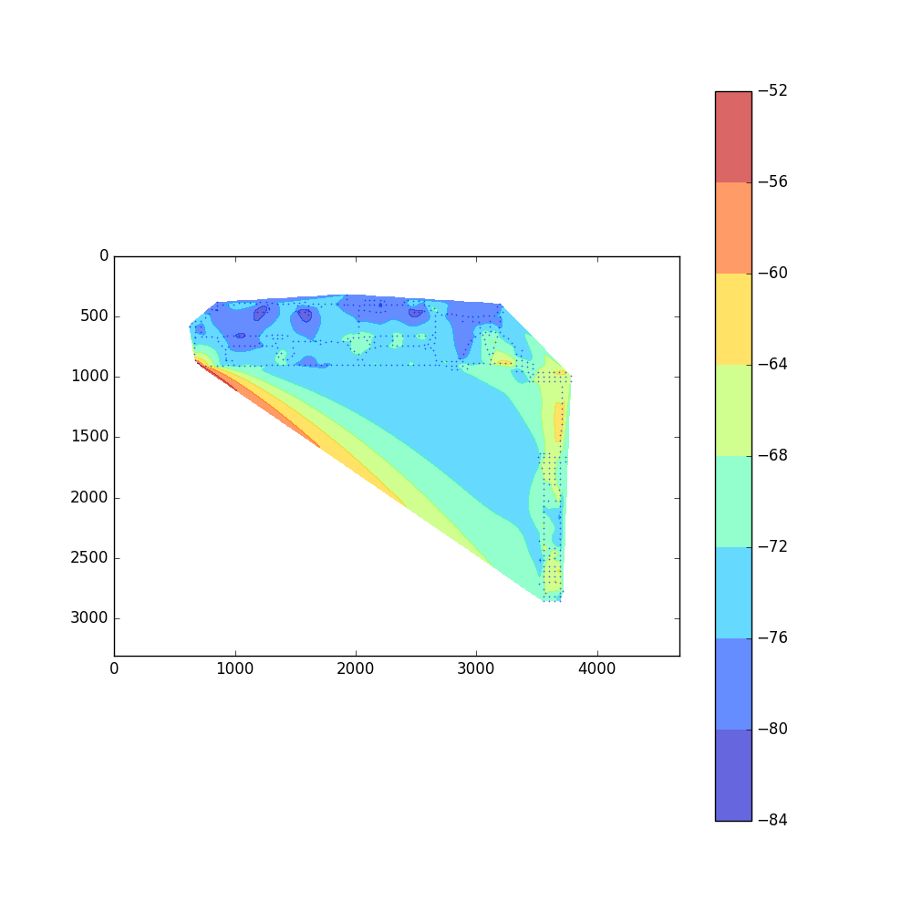
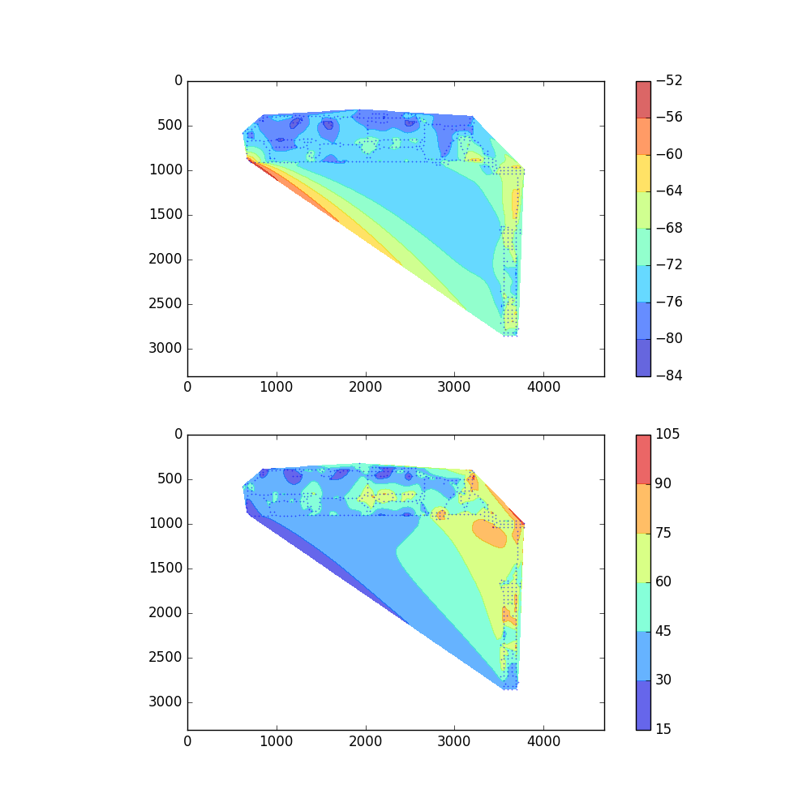

# Drawing heatmaps based on csv file

### Input
- ./data/data.csv
    + contains no headers
    + line format: "x,y,v1,v2"
- ./data/bg.png: the background image file

### Output
- output.png, which is the heatmap

### program files
- heatmap_3cols.py:
    + takes the first 3 cloumns (x,y,v1) to draw the heatmap

    

- heatmap_4cols.py:
    + will output 2 subgraphs
    + draw two heatmaps, one for (x,y,v1)
    + the other for (x,y,v2)

    
