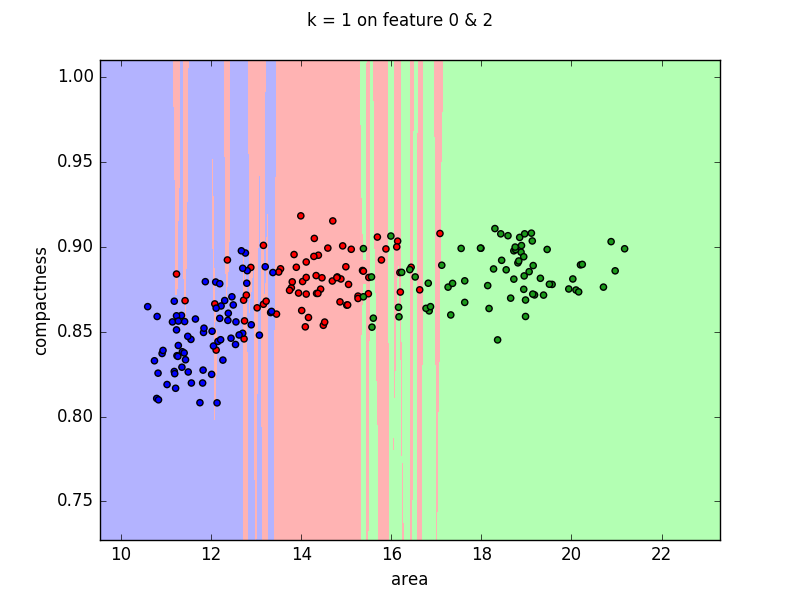

# KNN Classifier on Seeds Dataset

## Scenario
- We have [Seeds dataset](https://archive.ics.uci.edu/ml/datasets/seeds), and want to classify them. The dataset looks like:

    ```
    15.26   14.84   0.871   5.763   3.312   2.221   5.22    1
    14.88   14.57   0.8811  5.554   3.333   1.018   4.956   1
    14.29   14.09   0.905   5.291   3.337   2.699   4.825   1
    13.84   13.94   0.8955  5.324   3.379   2.259   4.805   1
    16.14   14.99   0.9034  5.658   3.562   1.355   5.175   1
    14.38   14.21   0.8951  5.386   3.312   2.462   4.956   1
    ...
    ```

- Dataset infomation: The examined group comprised kernels belonging to three different varieties of wheat: Kama, Rosa and Canadian, 70 elements each.
- Dataset features information, all of these parameters were real-valued continuous:
    + area A,
    + perimeter P, 
    + compactness C = 4*pi*A/P^2, 
    + length of kernel, 
    + width of kernel, 
    + asymmetry coefficient,
    + length of kernel groove. 
- Try [K Nearest Neighbors (KNN) classifier](http://en.wikipedia.org/wiki/K-nearest_neighbor_algorithm).

## Analysis
- Notes on feature engineering: 

    > Principle: A simple algorithm on well-chosen features will perform better than a fancy algorithm on not-so-good features.
    > 
    > Look at the compactness feature, it is derived from other features.
    > 
    > The goals of a good feature are to simultaneously vary with what matters (the desired output) and be invariant with what does not.
    > 
    > Feature selection is used to select good features automatically.
    
- Notes on knn classifier:

    > If k==1, when new target comes in, the classifier find the nearest one in the training data then return its label as the result.
    > 
    > Else, the K nearest ones vote then return the voting result, which makes the classifier more robust to outliers or mislabeled data.

- Protocol of classifiers in sklearn:
    + fit(features, labels): train and get the model.
    + predict(features): make predictions on new coming data.
    [full api spec on knn in sklearn](http://scikit-learn.org/stable/modules/generated/sklearn.neighbors.KNeighborsClassifier.html)

- Try 1NN & run 5 fold cross validation:

    ```python
    import numpy as np
    from sklearn.neighbors import KNeighborsClassifier
    from sklearn.cross_validation import KFold
    data = np.genfromtxt('seeds_dataset.txt')
    features, labels = data[:, 0:7], data[:, -1]
    classifier = KNeighborsClassifier(n_neighbors=1)
    errs = []
    for train, test in KFold(features.shape[0], 5, True):  # True means we need shuffle the data
        classifier.fit(features[train], labels[train])
        pred = classifier.predict(features[test])
        err = (pred == labels[test]).mean()
        errs.append(err)
    print '%.3f' % np.mean(errs)  # 0.905, can be different due to shuffle
    ```

- Visualise the decision boundary:
    + As we cannot plot in 7D and we are more familiar with 2D, we have to pick 2 features to represent the dataset somehow:

    ```python
    from itertools import combinations
    for i1, i2 in combinations(range(features.shape[1]), 2):
        features2 = features[:, (i1, i2)]
        errs = []
        for train, test in KFold(features.shape[0], 5, True):
            classifier.fit(features2[train], labels[train])
            pred = classifier.predict(features2[test])
            errs.append((pred == labels[test]).mean())
        print i1, i2, '%.3f' % np.mean(errs)
    # output
    0 1 0.810
    0 2 0.819
    0 3 0.829
    0 4 0.852
    0 5 0.886
    0 6 0.876
    1 2 0.848
    1 3 0.852
    1 4 0.819
    1 5 0.895
    1 6 0.905
    2 3 0.800
    2 4 0.833
    2 5 0.495
    2 6 0.733
    3 4 0.786
    3 5 0.810
    3 6 0.914
    4 5 0.833
    4 6 0.890
    5 6 0.762
    ```
    
    + After brute force, we can see that selecting feature 3 and 6 has the best performance in cross validation, let's visualize the decision boundary:

    ```python
    featureNames = ['area', 'perimeter', 'compactness', 'length of kernel', 'width of kernel', 'asymmetry coefficient', 'length of kernel groove']


    def plot_2d_knn_decision(featureIndices, features, labels, num_neighbors=1):
        '''
        this function is taken from:
        https://github.com/grehujt/BuildingMachineLearningSystemsWithPython/blob/master/ch02/figure4_5_sklearn.py
        '''
        features2 = features[:, (featureIndices[0], featureIndices[1])]
        x0, x1 = features2[:, 0].min() * .9, features2[:, 0].max() * 1.1
        y0, y1 = features2[:, 1].min() * .9, features2[:, 1].max() * 1.1
        X = np.linspace(x0, x1, 1000)  # shape: (1000,)
        Y = np.linspace(y0, y1, 1000)  # shape: (1000,)
        X, Y = np.meshgrid(X, Y)  # X.shape: (1000, 1000), Y.shape: (1000, 1000)

        model = KNeighborsClassifier(num_neighbors)
        model.fit(features2, labels)
        C = model.predict(np.vstack([X.ravel(), Y.ravel()]).T).reshape(X.shape)
        cmap = ListedColormap([(1., .7, .7), (.7, 1., .7), (.7, .7, 1.)])

        fig, ax = plt.subplots()  # concise way of "fig = plt.figure(); ax = fig.add_subplot(111)"
        ax.set_xlim(x0, x1)
        ax.set_ylim(y0, y1)
        ax.set_xlabel(featureNames[featureIndices[0]])
        ax.set_ylabel(featureNames[featureIndices[1]])
        ax.pcolormesh(X, Y, C, cmap=cmap)

        cmap = ListedColormap([(1., .0, .0), (.1, .6, .1), (.0, .0, 1.)])
        # c=labels, use labels to color data points, mapping to cmap
        ax.scatter(features2[:, 0], features2[:, 1], c=labels, cmap=cmap)

        return fig, ax

    # visualise the decision boundary for feature 3 & 6
    fig, ax = plot_2d_knn_decision([3, 6], features, labels, 1)
    fig.savefig('./pics/figure1.png')
    ```

    

    + Let's try feature 0 & 2:

    ```python
    fig, ax = plot_2d_knn_decision([0, 2], features, labels, 1)
    fig.savefig('./pics/figure2.png')
    ```

    


