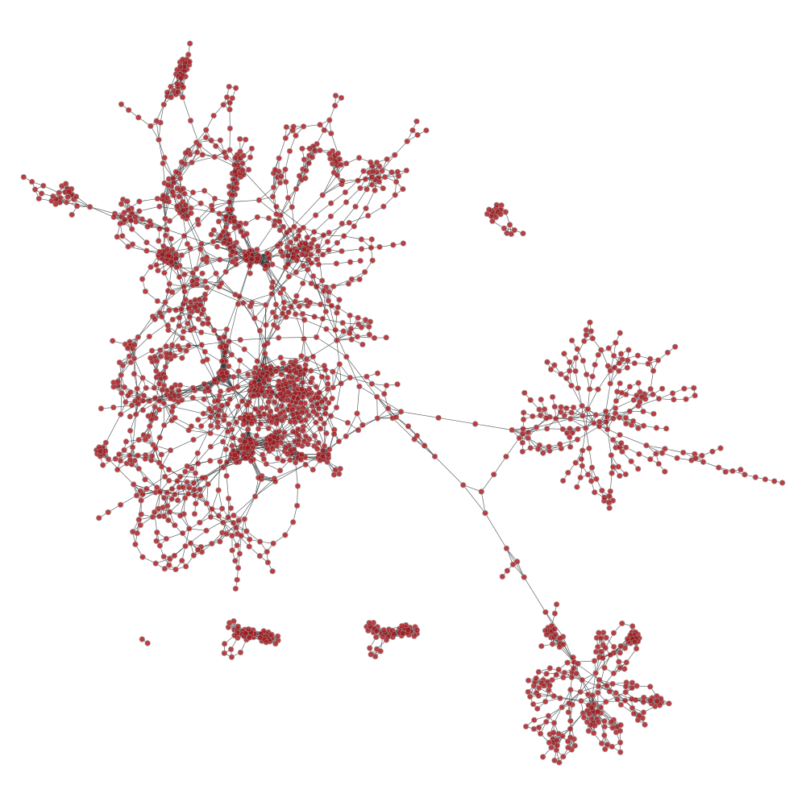
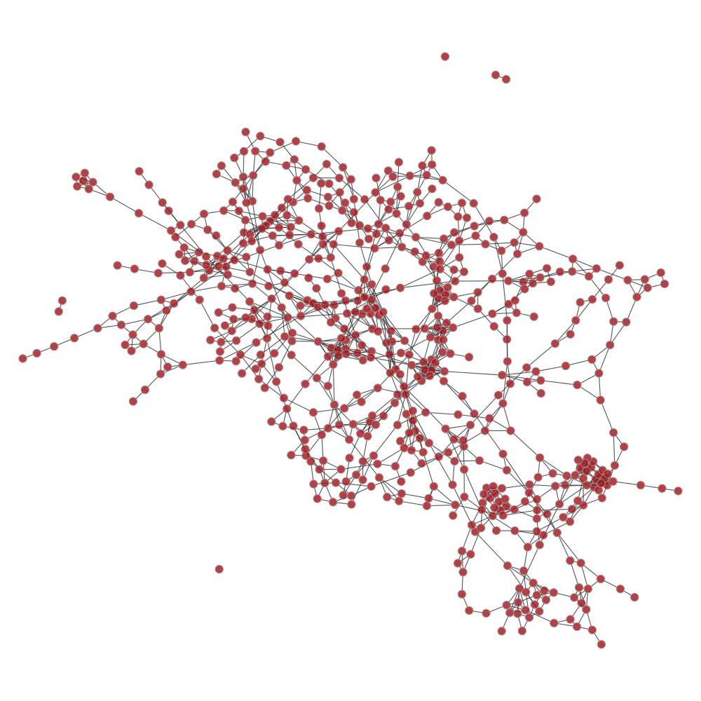

# Restful navigation server demo

### Scenario

- Alice gets lost in a big shopping mall.
- She only knows that she is next to shop A on floor X.
- She wants to find a path to shop B.
- She is a professional front-end programmer, who wants to build a app to get rid of this kind of headache.
- She needs a restful server for path finding to make her life eaiser.

---

### Overview

> Let us build a server for her. We are going to impelement a restful server, which can handle multiple sites (so that the structural changes of server get minimized if Alice wants to do the same thing for other malls).
>
> And the server takes json input with information of site (since we can handle multi-sites) & floor number & current location then replys with the shortest path in form of a json list of paths with corresponding floors (if it is the multi-floors case).
>

---

### Analysis

> Since we are trying to find the shortest path, we must have pre-defined vertices and edges between them so that we can build a graph. Let us see some demo graphs:
>
> test site 1:
>
> 
>
> test site 2:
>
> 
>
> The source and destination location are given by the clients, which can be new vertices and edges in our graph. If we add those new vertices and edges into our graph, we have to make a copy graph for individual client to avoid interferences, which is not cost-effective.
>
> Or we can find the nearest vertices for source and destination and find the shortest path between the nearest vertices (nearest vertex to source and nearest vertex to destination), and then we can simply connect them to get the final path. In this case, we just need one copy of graph.
>
> Also We need to take care of invalid input locations (e.g. inaccessible locations) , which means we should have some strategies to verify if input locations are accessible.
>

---

### Solution

- Convex polygons:

    We can identify the accessible regions by convex polygons, and we can verify if the input locations are accessible by [PIP](https://en.wikipedia.org/wiki/Point_in_polygon) (Point-In-Polygon) algorthms.

- Connectors:

    Connectors are the points that connect two (or more) polygons.

- Edges and vertices:

    Edges and vertices come from:
    + connectors, as we are using convex polygons, we can build the edges from connectors of the same polygons by simply connecting them.
    + points that make connections among floors.

---

### Libraries

- [graph_tool](https://graph-tool.skewed.de), writing a shortest path solution is not difficult, but writng a efficient one in python is difficult. Graph_tool is the most efficient graph libary so far, based on c++ boost graph library.

- [scipy](https://www.scipy.org), we just need the kd-tree submodule, and it is for efficiently finding the nearest vertex

- [falcon](http://falconframework.org), WSGI framework

- [bjoern](https://github.com/jonashaag/bjoern), web server

- [requests](http://docs.python-requests.org/en/master/), for http requests

- [ujson](https://github.com/esnme/ultrajson), fastest json library

---

### Project files

- [pics](./pics):

    contains some images for demo

- [navi.json](./navi.json):

    the json conf file,

    ```json
    {
        "testSite": {
            "floorHeight":300,
            "edgeUrl":"https://<edges_url>",
            "connectorUrl":"https://<connectors_url>",
            "regionUrl":"https://<regions>"
        },
    }
    ```

    + floorHeight: the average height of floor, which is used to calculate the total distance in multi-floor navigation.
    
    + edgeUrl
    
        points to a restful server that provides data like:

        ```json
        [
            {
                "fromArea": 1000,
                "_id": 1,
                "toPt": "[3045, 2261]",
                "toRegion": 75,
                "fromRegion": 69,
                "toArea": 1002,
                "fromPt": "[3050, 2247]"
            },
            ...
        ]
        ```

        - fromArea: the source floor id
        - \_id: the edge id
        - toPt: the destination location, [x, y]
        - toRegion: the destination polygon id
        - fromRegion: the source polygon id
        - toArea: the destination floor id
        - fromPt: the source location, [x, y]

    + connectorUrl
    
        points to a restful server that provides data like:

        ```json
        [
            {
                "regions": "[0, 2]",
                "pts": "[878, 1159]",
                "_id": 1,
                "areaId": 1000
            },
            ...
        ]
        ```

        - regions: which polygons are connected by this connector
        - pts: the connector location
        - \_id: the connector id
        - areaId: the floor id

    + regionUrl

        the source of convex polygons, points to a restful server that provides data like:

        ```json
        [
            {
                "polyId": 1,
                "_id": 1,
                "areaId": 1000,
                "vertex": "[768, 1144, 770, 1210, 799, 1209, 803, 1152]"
            },
            ...
        ]
        ```

        - polyId: the polygon id, which is unique per floor
        - \_id: the (internal) polygon id, which is unique per site
        - areaId: the floor id
        - vertex: the vetices in **anti-clockwise** order

- [navi.py](./navi.py):

    the main entry

- [poly_math.py](./poly_math.py):

    the PIP algorithms and related classes and some helper functions
