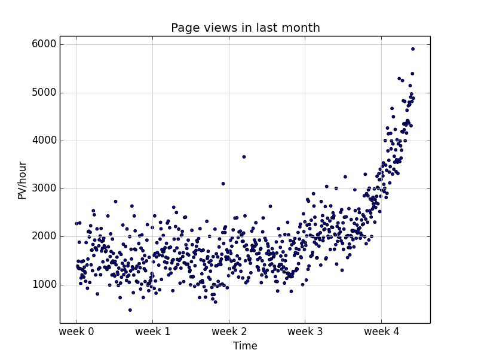
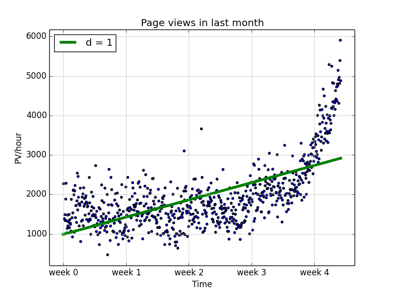
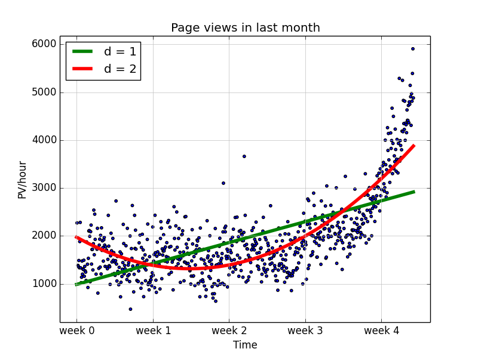
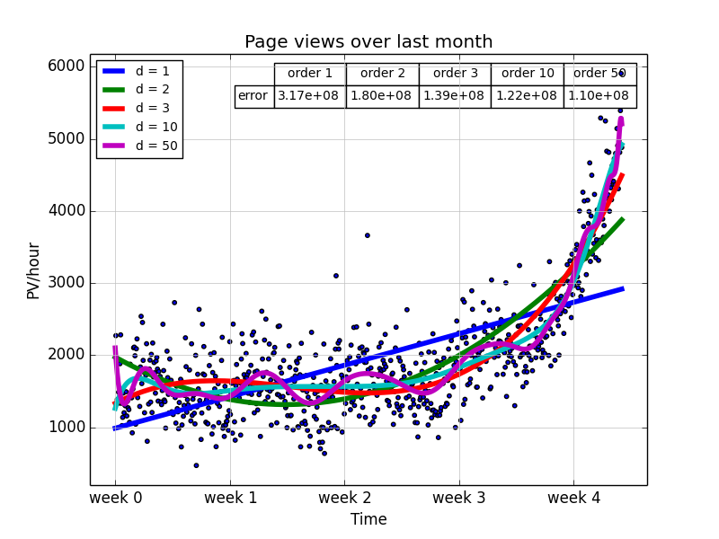
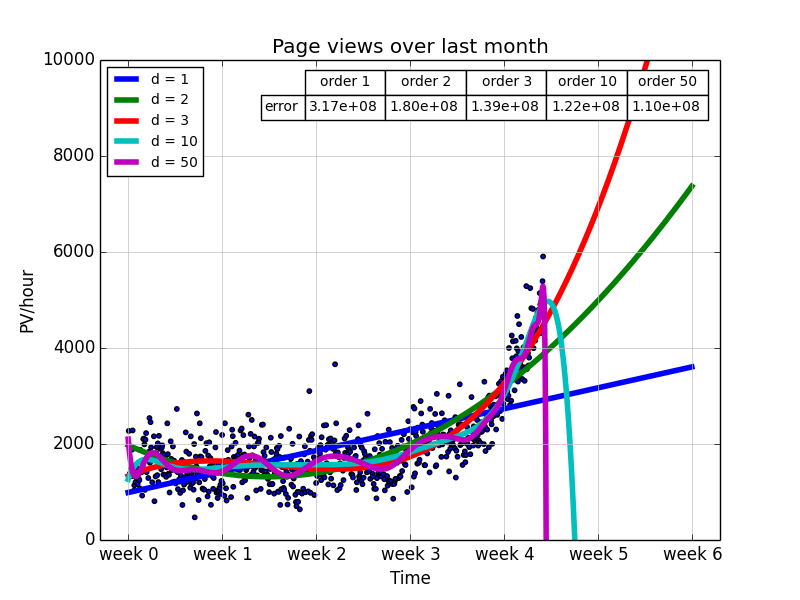
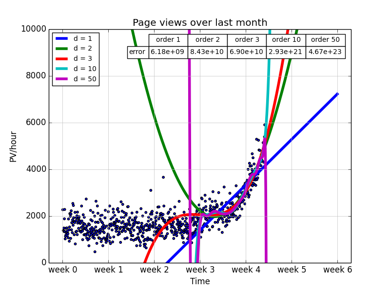
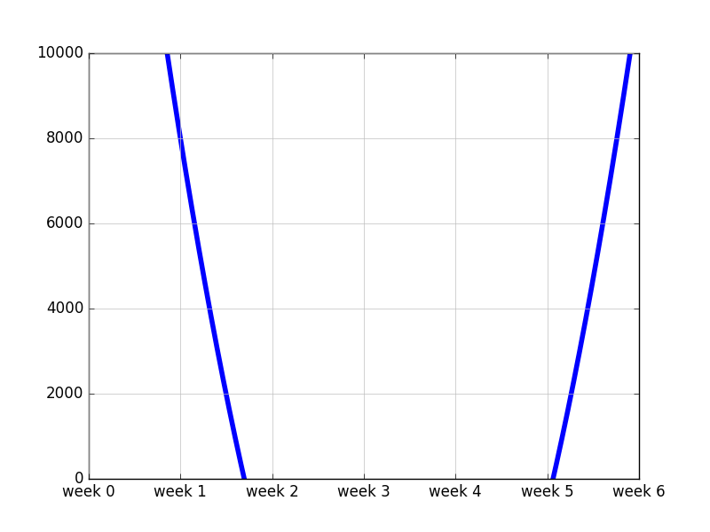

# Making Prediction Based On Curve Fitting

_NOTE: this example is taken from **Building Machine Learning System in Python**._

### Key points
- Basic feelings on machine learning system.
    1. data cleaning
    2. feature engineering
    3. data modeling
    4. models evaluation
- Basic usages of curve fitting functions in scipy.
- Basic usages of data visualization of matplotlib.

### Scenario
- We are running a website, as time goes by, an increasing number of users are attracted by our website.
- We are going to allocate resources (more servers) to make our clients happy.
- But we do not want to waste money on allocating too many resources.
- We have a [tsv](./web_traffic.tsv) (tab-seperated values) file, which contains the web stats for last month. And each line contains the hour consecutively and number of page views in that hour.
- We want to know in advance when our current limit will be hit (10k requests per hour).

### Step-by-step solution
1. Data cleaning.
    + Load & view the data:
    
        ```python
        data = sp.genfromtxt('web_traffic.tsv', delimiter='\t')
        print data.shape
        print data[:10]
        ```

        >     (743, 2)
        >     [[  1.00000000e+00   2.27200000e+03]
        >      [  2.00000000e+00              nan]
        >      [  3.00000000e+00   1.38600000e+03]
        >      [  4.00000000e+00   1.36500000e+03]
        >      [  5.00000000e+00   1.48800000e+03]
        >      [  6.00000000e+00   1.33700000e+03]
        >      [  7.00000000e+00   1.88300000e+03]
        >      [  8.00000000e+00   2.28300000e+03]
        >      [  9.00000000e+00   1.33500000e+03]
        >      [  1.00000000e+01   1.02500000e+03]]
    
    + Find out if we can drop the 'nan' data:

        ```python
        x = data[:, 0]
        y = data[:, 1]
        print sp.sum(sp.isnan(y)) # 8
        ```

        In this case, we have 8 nan out of 743 samples, we can afford to drop them.

    + Data clean up:
    
        ```python
        x = x[~sp.isnan(y)]
        y = y[~sp.isnan(y)]
        ```

    + Visulise the data to get a feeling:

        ```python
        plt.scatter(x, y, s=10)
        plt.title('Page views in last month')
        plt.xlabel('Time')
        plt.ylabel('PV/hour')
        # set x ticks by week count
        plt.xticks([w*7*24 for w in range(10)], ['week %d'%w for w in range(10)])
        plt.autoscale(tight=True)
        plt.grid(True, linestyle='-', color='0.75')
        plt.show()
        ```

        

2. Feature Engineering. 
    In our case, 2-d data, skipped.

3. Data modeling
    + Having error function, we can compare the performance differences among models:
    
        ```python
        def error(f, x, y):
            return sp.sum(sp.power(f(x) - y, 2))
        ```

    + Let us try 1d fitting:
    
        ```python
        fp1 = sp.polyfit(x, y, 1)
        print fp1  # [   2.59619213  989.02487106]
        f1 = sp.poly1d(fp1)
        print type(f1)  # <class 'numpy.lib.polynomial.poly1d'>
        print f1  # 2.596 x + 989
        print error(f1, x, y)  # (317389767.34+0j)
        ```

    + Visualise 1d fitting:

        ```python
        fx = sp.linspace(0, x[-1], 1000)
        plt.plot(fx, f1(fx), color='green', linewidth=4)
        plt.legend(['d = %d' % f1.order], loc='upper left')
        plt.show()
        ```

        

    + Likewise, we can try 2d:

        ```python
        fp2 = sp.polyfit(x, y, 2)
        print fp2  # [  1.05322215e-02  -5.26545650e+00   1.97476082e+03]
        f2 = sp.poly1d(fp2)
        print type(f2)  # <class 'numpy.lib.polynomial.poly1d'>
        print f2  # 0.01053 x^2 - 5.265 x + 1975
        print error(f2, x, y)  # (179983507.878+0j)

        plt.plot(fx, f2(fx), color='red', linewidth=4)
        plt.legend(['d = %d' % f.order for f in [f1, f2]], loc='upper left')
        plt.show()
        ```

        

    + Moreover, if we increase the order of fitting function, our error gets smaller and smaller:

        

4. Model evaluation
    + However, if we expand our x domain, we will see that functions with higer order try so hard to fit our current dataset, as a result, they can not extrapolate beyond. This is called overfitting. On the other hand, the lower degree models seem not able to capture our dataset well, this is called underfitting.

        

    + If we only use data after week 3 and train the same models, we can see the effects of overfitting more clearly:

        

    + 5-fold validation:

        ```python
        from sklearn.cross_validation import KFold
        result = {}
        for train, test in KFold(y_lastweek.shape[0], 5, True):
            print train.shape, test.shape
            x_train, x_test = x_lastweek[train], x_lastweek[test]
            y_train, y_test = y_lastweek[train], y_lastweek[test]
            for d in [1, 2, 3, 10, 50]:
                if d not in result:
                    result[d] = []
                f = gen_model(x_train, y_train, d)
                result[d].append(error(f, x_test, y_test))
        for k, v in result.iteritems():
            print k, '\t'.join('%.2e' % x for x in v), '\t%.2e' % np.mean(v)

        ## output:
        50 5.18e+06 4.94e+06    3.78e+06    4.00e+06    1.62e+07    6.83e+06
        1 5.21e+06  5.41e+06    5.79e+06    4.71e+06    6.41e+06    5.51e+06
        2 5.00e+06  4.46e+06    4.41e+06    3.36e+06    5.19e+06    4.48e+06
        3 4.95e+06  4.53e+06    4.32e+06    3.79e+06    5.09e+06    4.54e+06
        10 4.55e+06 4.77e+06    3.83e+06    3.93e+06    9.73e+06    5.36e+06
        ```

### Conclusion

Clearly that degree 2 model has least mean error in the cross validation, we can make our 10k prediction by finding the root from the polynomial substracting 10k:

```python
def gen_model(x, y, degree):
    fp = np.polyfit(x, y, degree)
    return np.poly1d(fp)

from scipy.optimize import fsolve
bestF = gen_model(x_lastweek, y_lastweek, 2) - 10000
roots = fsolve(bestF, x0=800) / (7.0 * 24)
print roots  # [ 5.0628393]

plt.figure()
plt.xticks([w*7*24 for w in range(10)], ['week %d'%w for w in range(10)])
plt.autoscale(tight=True)
plt.grid(True, linestyle='-', color='0.75')
plt.ylim(0, 10000)
plt.plot(fx, bestF(fx), linewidth=4)
plt.show()
```



Finally, we can predict that in week 5, we are going to reach 10k hits per hour.