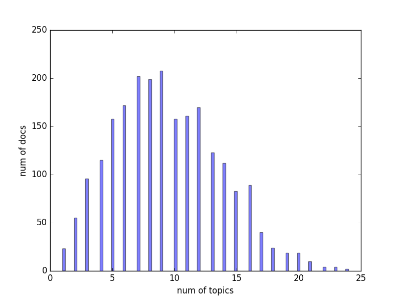
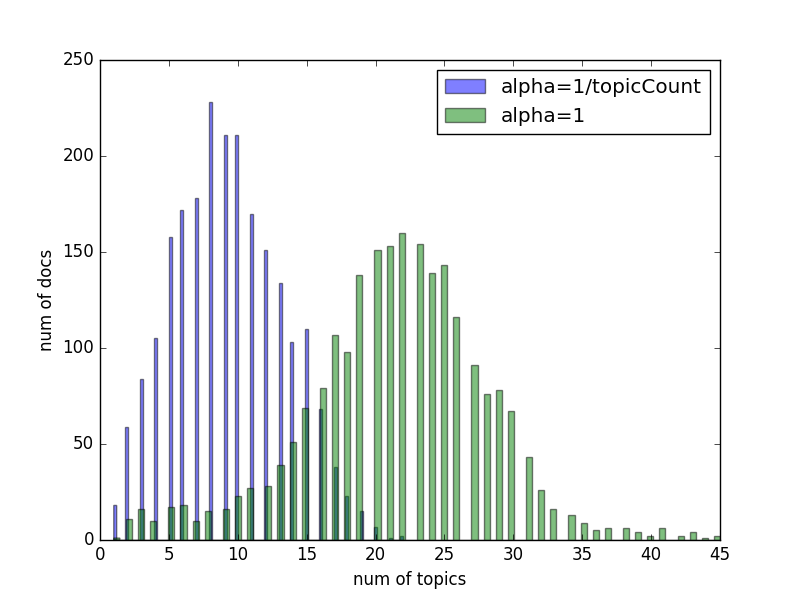

# Topic Modeling

## Scenario

We have 2246 documents from the Associated Press, and we are going to investigate the topics of them and group similar documents to related topics.

[Click here to download the dataset.](http://www.cs.princeton.edu/~blei/lda-c/ap.tgz)

## Anaysis

- Unlike clustering, one document can talk about more than 1 topics, we need a way to infer the topics from corpus and group them.

- Latent Dirichlet Allocation
    + [wiki](http://en.wikipedia.org/wiki/Latent_Dirichlet_allocation)
    + [paper](http://www.cs.princeton.edu/~blei/papers/BleiNgJordan2003.pdf)
    + Simply put, LDA is a probabilistic model which assigns different weights on words from different topics and allows you to analyze of corpus, and extract the topics to form its documents. The input of the model is a list of documents, and the output is a list of topics with related weighted words.

- Sklearn has implementation of LDA, but the interface is not as friendly as [gensim](https://radimrehurek.com/gensim/)'s, so I am going to use gensim here. Once finished downloading & extracting the zip, we will see thress files:
    + ap.txt, which is the raw text of 2246 documents;
    + ap.dat, BleiC format file, which is the preprocessed version of the documents in ap.txt, contains 2246 lines and each line represents one documents in the following format: 
    
    > docId termId:termCount termId:termCount ...
    
    + vocab.txt, containing all distinct words occurred in the 2246 documents.

- We can import the dataset and feed it into our lda model using gensim:

    (Noted that we set num_topics=100 here)

    ```python
    from gensim import corpora, models
    corpus = corpora.BleiCorpus('./data/ap.dat', './data/vocab.txt')
    print type(corpus)
    print dir(corpus)
    model = models.ldamodel.LdaModel(corpus, num_topics=100, id2word=corpus.id2word)
    # output:
    <class 'gensim.corpora.bleicorpus.BleiCorpus'>
    ['__class__', '__delattr__', '__dict__', '__doc__', '__format__', '__getattribute__', '__getitem__', '__hash__', '__init__', '__iter__', '__len__', '__module__', '__new__', '__reduce__', '__reduce_ex__', '__repr__', '__setattr__', '__sizeof__', '__str__', '__subclasshook__', '__weakref__', '_adapt_by_suffix', '_load_specials', '_save_specials', '_smart_save', 'docbyoffset', 'fname', 'id2word', 'index', 'length', 'line2doc', 'load', 'save', 'save_corpus', 'serialize']
    ```

    More on the constructor can be found [here](# https://radimrehurek.com/gensim/corpora/bleicorpus.html).

- After feeding our model, we can do some exploring:

    ```python
    doc = corpus.docbyoffset(0)  # grap first doc in the corpus
    topics = model[doc]  # grop the topics it talked about
    print topics
    # [(2, 0.025557527971728191),
    #  (13, 0.019739219934498245),
    #  (16, 0.53534741785582873),
    #  (32, 0.079707457065004594),
    #  (34, 0.016242485776949589),
    #  (38, 0.011064365938014683),
    #  (49, 0.11325518263205145),
    #  (51, 0.012685628601841499),
    #  (54, 0.011589007379718155),
    #  (66, 0.020586404205020049),
    #  (87, 0.035147854577898527),
    #  (89, 0.018680487534867025),
    #  (94, 0.070224719493546028)]

    # plot the hist of topic count in the corpus
    numTopics = [len(model[d]) for d in corpus]
    hist1= plt.hist(numTopics, alpha=0.5, bins=100, label='alpha=1/topicCount', rwidth=0.5)
    plt.grid()
    plt.xlabel('num of topics')
    plt.ylabel('num of docs')
    plt.savefig('pics/pic0.png')
    ```

    

- One of the most important parameter in the LDA model contructor is alpha. By default, gensim will set alpha to 1/num_topics. The smaller alpha is, the fewer topics each document will be expected to discuss, if we change alpha to 1:

    ```python
    model = models.ldamodel.LdaModel(corpus, num_topics=100, id2word=corpus.id2word, alpha=1)
    topics = model[doc]
    numTopics = [len(model[d]) for d in corpus]
    hist2 = plt.hist(numTopics, alpha=0.5, bins=100, label='alpha=1')
    plt.legend()
    plt.xlabel('num of topics')
    plt.ylabel('num of docs')
    plt.savefig('pics/pic1.png')
    ```

    

- Extract top 10 hottest topics:

    ```python
    topics = matutils.corpus2dense(model[corpus], num_terms=model.num_topics)
    weight = topics.sum(1)
    tIdices = weight.argsort()

    h = '''| topic id        | words           |
    | :-------------: |:-------------:|'''
    print h
    for i in xrange(-1, -11, -1):
        words = model.show_topic(tIdices[i])
        print '|', tIdices[i], '|', ' '.join(s[0] for s in sorted(words, key=lambda d: d[1], reverse=True)), '|'
    ```

    | topic id        | words           |
    | :-------------: |:-------------:|
    | 36 | bush i new dukakis trade primary states president year campaign |
    | 13 | united billion government states new economic officials world first people |
    | 45 | government united president year i states new military two congress |
    | 63 | police years two ruby school day i million year porter |
    | 30 | i convention president people soviet black new years government research |
    | 73 | percent year billion last million new police years tax spending |
    | 32 | soviet dinner reagan bentsen i president people union souter american |
    | 56 | percent year billion poll orders economy increase october rates rose |
    | 38 | year i percent today report first program market get two |
    | 24 | i south people nea state think court frohnmayer year victims |

- Compare documents in topic space:
    + topic modeling can group documents into more than 1 topics
    + topic modeling can reduce dimension as well, as topic vectors are usually shorter than term vectors.

    ```python
    from scipy.spatial import distance
    # calculate pairwise distance between topic vectors
    pdists = distance.squareform(distance.pdist(topics))
    # excluding self
    largest = pdists.max()
    for i in xrange(pdists.shape[0]):
        pdists[i][i] = largest + 1

    import re
    rawtext = re.findall(r'(?s)<TEXT>(.*?)</TEXT>', open('./data/ap.txt').read())
    testDocIdx = 1
    mostSimDocIdx = pdists[testDocIdx].argmin()
    print rawtext[testDocIdx]
    print
    print
    print
    print rawtext[mostSimDocIdx]
    ```

    Test doc:

    >  The Bechtel Group Inc. offered in 1985 to sell oil to Israel at a discount of at least $650 million for 10 years if it promised not to bomb a proposed Iraqi pipeline, a Foreign Ministry official said Wednesday. But then-Prime Minister Shimon Peres said the offer from Bruce Rappaport, a partner in the San Francisco-based construction and engineering company, was ``unimportant,'' the senior official told The Associated Press. Peres, now foreign minister, never discussed the offer with other government ministers, said the official, who spoke on condition of anonymity. The comments marked the first time Israel has acknowledged any offer was made for assurances not to bomb the planned $1 billion pipeline, which was to have run near Israel's border with Jordan. The pipeline was never built. In San Francisco, Tom Flynn, vice president for public relations for the Bechtel Group, said the company did not make any offer to Peres but that Rappaport, a Swiss financier, made it without Bechtel's knowledge or consent. Another Bechtel spokesman, Al Donner, said Bechtel ``at no point'' in development of the pipeline project had anything to do with the handling of the oil. He said proposals submitted by the company ``did not include any specific arrangements for the handling of the oil or for the disposal of the oil once it reached the terminal.'' Asked about Bechtel's disclaimers after they were made in San Francisco, the Israeli Foreign Ministry official said Peres believed Rappaport made the offer for the company. ``Rappaport came to Peres as a representative of Bechtel and said he was speaking on behalf of Bechtel,'' the official said. ``If he was not, he misrepresented himself.'' The Jerusalem Post on Wednesday quoted sources close to Peres as saying that according to Rappaport, Bechtel had said the oil sales would have to be conducted through a third party to keep the sales secret from Iraq and Jordan. The Foreign Ministry official said Peres did not take the offer seriously. ``This is a man who sees 10 people every day,'' he said. ``Thirty percent of them come with crazy ideas. He just says, `Yes, yes. We'll think about it.' That's how things work in Israel.'' The offer appeared to be the one mentioned in a September 1985 memo to Attorney General Edwin Meese III. The memo referred to an arrangement between Peres and Rappaport ``to the effect that Israel will receive somewhere between $65 million and $70 million a year for 10 years.'' The memo from Meese friend E. Robert Wallach, Rappaport's attorney, also states, ``What was also indicated to me, and which would be denied everywhere, is that a portion of those funds will go directly to Labor,'' a reference to the political party Peres leads. The Wallach memo has become the focus of an investigation into whether Meese knew of a possibly improper payment. Peres has denied any wrongdoing and has denounced the memo as ``complete nonsense.'' The Israeli official said Rappaport, a native of Israel and a close friend of Peres, relayed the offer to Peres earlier in September. ``Peres thought the offer was unimportant. For him, the most important thing was to have an Iraqi oil port near Israel's border,'' the official said. ``The thinking was that this would put Iraq in a position where it would not be able to wage war with Israel, out of concern for its pipeline.'' A person answering the telephone at Rappaport's Swiss residence said he was out of town and could not be reached for comment.

    Result:

    > Demolitions experts disarmed three powerful homemade bombs at a New Jersey Turnpike rest area and arrested a man for possession of explosives, police said. Lt. Barry Roberson, a state police spokesman, said the bombs and some leftover explosive materials were discovered in the car of a man attempting to flee a trooper Tuesday morning. Trooper Robert Cieplinsky told his superiors he had noticed the man acting suspiciously near a parked car at turnpike rest area less than 10 miles west of New York City, Roberson said. Cieplinsky stopped the car and noticed a black gym bag filled with gunpowder canisters and small pellets, which Roberson described as objects used to make homemade bombs. The trooper discovered the three bombs in the trunk of the car, Roberson said, and arrested the man for possession of an explosive device. Roberson declined to give the man's name and said an investigation was continuing. Cieplinsky closed off a portion of the rest area and called for assistance from the state police bomb and explosives investigative team, who used a water cannon to saturate the devices and render them inoperable, Roberson said. In Tokyo, a Foreign Ministry official, speaking on condition of anonymity, said the ministry had received information through the Japanese Embassy in Washington that the man detained in New Jersey for possession of explosives was carrying a Japanese passport. He said the ministry would seek more details about the man and provide information to U.S. investigators, but declined to give further details. Japan's Kyodo News Service reported that Japanese authorities believe the man held in the United States may have a forged passport or may have obtained it illegally. Kyodo said Japanese investigators would ask the United States to send the fingerprints of the man detained for identification.
