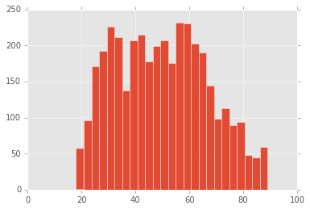

```python
%matplotlib inline
import matplotlib.pyplot as plt
import numpy as np
import pandas as pd
plt.style.use('ggplot')
```


```python
gssData = pd.read_stata('GSS2014merged_R6.dta', convert_categoricals=False)
gssData.head()
```


<div>
<table border="1" class="dataframe">
  <thead>
    <tr style="text-align: right;">
      <th></th>
      <th>year</th>
      <th>id</th>
      <th>wrkstat</th>
      <th>hrs1</th>
      <th>hrs2</th>
      <th>evwork</th>
      <th>wrkslf</th>
      <th>wrkgovt</th>
      <th>occ10</th>
      <th>prestg10</th>
      <th>...</th>
      <th>clsgayw</th>
      <th>othgayw</th>
      <th>clsnjobm</th>
      <th>othnjobm</th>
      <th>clsnjobw</th>
      <th>othnjobw</th>
      <th>clspolm</th>
      <th>othpolm</th>
      <th>clspolw</th>
      <th>othpolw</th>
    </tr>
  </thead>
  <tbody>
    <tr>
      <th>0</th>
      <td>2014</td>
      <td>1</td>
      <td>1.0</td>
      <td>60.0</td>
      <td>NaN</td>
      <td>NaN</td>
      <td>1.0</td>
      <td>2.0</td>
      <td>220.0</td>
      <td>53.0</td>
      <td>...</td>
      <td>NaN</td>
      <td>NaN</td>
      <td>NaN</td>
      <td>NaN</td>
      <td>NaN</td>
      <td>NaN</td>
      <td>NaN</td>
      <td>NaN</td>
      <td>NaN</td>
      <td>NaN</td>
    </tr>
    <tr>
      <th>1</th>
      <td>2014</td>
      <td>2</td>
      <td>1.0</td>
      <td>40.0</td>
      <td>NaN</td>
      <td>NaN</td>
      <td>2.0</td>
      <td>2.0</td>
      <td>700.0</td>
      <td>51.0</td>
      <td>...</td>
      <td>NaN</td>
      <td>NaN</td>
      <td>NaN</td>
      <td>NaN</td>
      <td>NaN</td>
      <td>NaN</td>
      <td>NaN</td>
      <td>NaN</td>
      <td>NaN</td>
      <td>NaN</td>
    </tr>
    <tr>
      <th>2</th>
      <td>2014</td>
      <td>3</td>
      <td>4.0</td>
      <td>NaN</td>
      <td>NaN</td>
      <td>NaN</td>
      <td>2.0</td>
      <td>2.0</td>
      <td>8740.0</td>
      <td>39.0</td>
      <td>...</td>
      <td>NaN</td>
      <td>NaN</td>
      <td>NaN</td>
      <td>NaN</td>
      <td>NaN</td>
      <td>NaN</td>
      <td>NaN</td>
      <td>NaN</td>
      <td>NaN</td>
      <td>NaN</td>
    </tr>
    <tr>
      <th>3</th>
      <td>2014</td>
      <td>4</td>
      <td>2.0</td>
      <td>20.0</td>
      <td>NaN</td>
      <td>NaN</td>
      <td>2.0</td>
      <td>2.0</td>
      <td>50.0</td>
      <td>53.0</td>
      <td>...</td>
      <td>NaN</td>
      <td>NaN</td>
      <td>NaN</td>
      <td>NaN</td>
      <td>NaN</td>
      <td>NaN</td>
      <td>NaN</td>
      <td>NaN</td>
      <td>NaN</td>
      <td>NaN</td>
    </tr>
    <tr>
      <th>4</th>
      <td>2014</td>
      <td>5</td>
      <td>5.0</td>
      <td>NaN</td>
      <td>NaN</td>
      <td>1.0</td>
      <td>2.0</td>
      <td>1.0</td>
      <td>800.0</td>
      <td>60.0</td>
      <td>...</td>
      <td>NaN</td>
      <td>NaN</td>
      <td>NaN</td>
      <td>NaN</td>
      <td>NaN</td>
      <td>NaN</td>
      <td>NaN</td>
      <td>NaN</td>
      <td>NaN</td>
      <td>NaN</td>
    </tr>
  </tbody>
</table>
<p>5 rows × 970 columns</p>
</div>


```python
gssData.set_index('id')
gssData.drop('id', 1, inplace=True)
gssData.head()
```


<div>
<table border="1" class="dataframe">
  <thead>
    <tr style="text-align: right;">
      <th></th>
      <th>year</th>
      <th>wrkstat</th>
      <th>hrs1</th>
      <th>hrs2</th>
      <th>evwork</th>
      <th>wrkslf</th>
      <th>wrkgovt</th>
      <th>occ10</th>
      <th>prestg10</th>
      <th>prestg105plus</th>
      <th>...</th>
      <th>clsgayw</th>
      <th>othgayw</th>
      <th>clsnjobm</th>
      <th>othnjobm</th>
      <th>clsnjobw</th>
      <th>othnjobw</th>
      <th>clspolm</th>
      <th>othpolm</th>
      <th>clspolw</th>
      <th>othpolw</th>
    </tr>
  </thead>
  <tbody>
    <tr>
      <th>0</th>
      <td>2014</td>
      <td>1.0</td>
      <td>60.0</td>
      <td>NaN</td>
      <td>NaN</td>
      <td>1.0</td>
      <td>2.0</td>
      <td>220.0</td>
      <td>53.0</td>
      <td>75.0</td>
      <td>...</td>
      <td>NaN</td>
      <td>NaN</td>
      <td>NaN</td>
      <td>NaN</td>
      <td>NaN</td>
      <td>NaN</td>
      <td>NaN</td>
      <td>NaN</td>
      <td>NaN</td>
      <td>NaN</td>
    </tr>
    <tr>
      <th>1</th>
      <td>2014</td>
      <td>1.0</td>
      <td>40.0</td>
      <td>NaN</td>
      <td>NaN</td>
      <td>2.0</td>
      <td>2.0</td>
      <td>700.0</td>
      <td>51.0</td>
      <td>75.0</td>
      <td>...</td>
      <td>NaN</td>
      <td>NaN</td>
      <td>NaN</td>
      <td>NaN</td>
      <td>NaN</td>
      <td>NaN</td>
      <td>NaN</td>
      <td>NaN</td>
      <td>NaN</td>
      <td>NaN</td>
    </tr>
    <tr>
      <th>2</th>
      <td>2014</td>
      <td>4.0</td>
      <td>NaN</td>
      <td>NaN</td>
      <td>NaN</td>
      <td>2.0</td>
      <td>2.0</td>
      <td>8740.0</td>
      <td>39.0</td>
      <td>38.0</td>
      <td>...</td>
      <td>NaN</td>
      <td>NaN</td>
      <td>NaN</td>
      <td>NaN</td>
      <td>NaN</td>
      <td>NaN</td>
      <td>NaN</td>
      <td>NaN</td>
      <td>NaN</td>
      <td>NaN</td>
    </tr>
    <tr>
      <th>3</th>
      <td>2014</td>
      <td>2.0</td>
      <td>20.0</td>
      <td>NaN</td>
      <td>NaN</td>
      <td>2.0</td>
      <td>2.0</td>
      <td>50.0</td>
      <td>53.0</td>
      <td>73.0</td>
      <td>...</td>
      <td>NaN</td>
      <td>NaN</td>
      <td>NaN</td>
      <td>NaN</td>
      <td>NaN</td>
      <td>NaN</td>
      <td>NaN</td>
      <td>NaN</td>
      <td>NaN</td>
      <td>NaN</td>
    </tr>
    <tr>
      <th>4</th>
      <td>2014</td>
      <td>5.0</td>
      <td>NaN</td>
      <td>NaN</td>
      <td>1.0</td>
      <td>2.0</td>
      <td>1.0</td>
      <td>800.0</td>
      <td>60.0</td>
      <td>85.0</td>
      <td>...</td>
      <td>NaN</td>
      <td>NaN</td>
      <td>NaN</td>
      <td>NaN</td>
      <td>NaN</td>
      <td>NaN</td>
      <td>NaN</td>
      <td>NaN</td>
      <td>NaN</td>
      <td>NaN</td>
    </tr>
  </tbody>
</table>
<p>5 rows × 969 columns</p>
</div>


```python
gssData.to_csv('GSS2014merged.csv')
```


```python
gssData['age'].hist()
plt.grid()
plt.locator_params(nbins=5)
```


```python
gssData['age'].hist(bins=25)
plt.locator_params(nbins=5)
```





```python
inc_age = gssData[['realrinc', 'age']]
inc_age.head()
```


<div>
<table border="1" class="dataframe">
  <thead>
    <tr style="text-align: right;">
      <th></th>
      <th>realrinc</th>
      <th>age</th>
    </tr>
  </thead>
  <tbody>
    <tr>
      <th>0</th>
      <td>39022.50</td>
      <td>53.0</td>
    </tr>
    <tr>
      <th>1</th>
      <td>39022.50</td>
      <td>26.0</td>
    </tr>
    <tr>
      <th>2</th>
      <td>NaN</td>
      <td>59.0</td>
    </tr>
    <tr>
      <th>3</th>
      <td>6503.75</td>
      <td>56.0</td>
    </tr>
    <tr>
      <th>4</th>
      <td>NaN</td>
      <td>74.0</td>
    </tr>
  </tbody>
</table>
</div>


```python
inc_age = gssData[['realrinc', 'age']].dropna()
inc_age.head(10)
```


<div>
<table border="1" class="dataframe">
  <thead>
    <tr style="text-align: right;">
      <th></th>
      <th>realrinc</th>
      <th>age</th>
    </tr>
  </thead>
  <tbody>
    <tr>
      <th>0</th>
      <td>39022.50000</td>
      <td>53.0</td>
    </tr>
    <tr>
      <th>1</th>
      <td>39022.50000</td>
      <td>26.0</td>
    </tr>
    <tr>
      <th>3</th>
      <td>6503.75000</td>
      <td>56.0</td>
    </tr>
    <tr>
      <th>5</th>
      <td>132148.07386</td>
      <td>56.0</td>
    </tr>
    <tr>
      <th>7</th>
      <td>15372.50000</td>
      <td>34.0</td>
    </tr>
    <tr>
      <th>9</th>
      <td>21285.00000</td>
      <td>30.0</td>
    </tr>
    <tr>
      <th>13</th>
      <td>11233.75000</td>
      <td>40.0</td>
    </tr>
    <tr>
      <th>14</th>
      <td>13007.50000</td>
      <td>25.0</td>
    </tr>
    <tr>
      <th>15</th>
      <td>11233.75000</td>
      <td>56.0</td>
    </tr>
    <tr>
      <th>16</th>
      <td>39022.50000</td>
      <td>51.0</td>
    </tr>
  </tbody>
</table>
</div>


```python
axs = inc_age.hist(bins=40, figsize=(8, 3), xrot=45)
for ax in axs[0]:
    ax.locator_params(axis='x', nbins=6)
    ax.locator_params(axis='y', nbins=3)
```


```python
inc_age[inc_age['realrinc'] > 1e5].count()
```


    realrinc    80
    age         80
    dtype: int64


```python
inc_age[inc_age['realrinc'] > 1e5].head(10)
```


<div>
<table border="1" class="dataframe">
  <thead>
    <tr style="text-align: right;">
      <th></th>
      <th>realrinc</th>
      <th>age</th>
    </tr>
  </thead>
  <tbody>
    <tr>
      <th>5</th>
      <td>132148.07386</td>
      <td>56.0</td>
    </tr>
    <tr>
      <th>17</th>
      <td>132148.07386</td>
      <td>46.0</td>
    </tr>
    <tr>
      <th>66</th>
      <td>132148.07386</td>
      <td>65.0</td>
    </tr>
    <tr>
      <th>67</th>
      <td>132148.07386</td>
      <td>57.0</td>
    </tr>
    <tr>
      <th>77</th>
      <td>132148.07386</td>
      <td>58.0</td>
    </tr>
    <tr>
      <th>127</th>
      <td>132148.07386</td>
      <td>38.0</td>
    </tr>
    <tr>
      <th>136</th>
      <td>132148.07386</td>
      <td>61.0</td>
    </tr>
    <tr>
      <th>217</th>
      <td>132148.07386</td>
      <td>46.0</td>
    </tr>
    <tr>
      <th>231</th>
      <td>132148.07386</td>
      <td>69.0</td>
    </tr>
    <tr>
      <th>241</th>
      <td>132148.07386</td>
      <td>51.0</td>
    </tr>
  </tbody>
</table>
</div>


```python
inc_age = gssData[['realrinc', 'age']]
lowinc_age = inc_age[inc_age['realrinc'] < 1e5]
axs = lowinc_age.hist(bins=20, figsize=(8, 3), xrot=45)
for ax in axs[0]:
    ax.locator_params(axis='x', nbins=6)
    ax.locator_params(axis='y', nbins=3)
```


```python
age = gssData['age'].dropna()
age.plot(kind='kde', lw=2)
plt.title('KDE plot for age')
plt.xlabel('Age')
```


    <matplotlib.text.Text at 0x1153459d0>


```python
ax = age.hist(bins=25, color='LightSteelBlue', normed=True)
age.plot(kind='kde', lw=2, ax=ax)
plt.title('Histogram and KDE for age')
plt.xlabel('Age')
```


    <matplotlib.text.Text at 0x115ea0890>


```python
import scipy.stats as stats
stats.probplot(age, dist='norm', plot=plt)
```


    ((array([-3.56557347, -3.32592156, -3.1936113 , ...,  3.1936113 ,
              3.32592156,  3.56557347]),
      array([ 18.,  18.,  18., ...,  89.,  89.,  89.])),
     (16.86927926580902, 49.837611314824514, 0.98880936001379327))


```python
inc = gssData['realrinc'].dropna()
inc = inc[inc < 1e5]
inc.describe()
```


    count     2252.000000
    mean     19178.396203
    std      14774.789813
    min        236.500000
    25%       7686.250000
    50%      15372.500000
    75%      26015.000000
    max      66220.000000
    Name: realrinc, dtype: float64


```python
inc.plot(kind='box')
```


    <matplotlib.axes._subplots.AxesSubplot at 0x11a07c7d0>


```python
inc_gen = gssData[['realrinc', 'sex']]
inc_gen = inc_gen[inc_gen['realrinc'] < 1e5]
inc_gen.boxplot(column='realrinc', by='sex')
```


    <matplotlib.axes._subplots.AxesSubplot at 0x11a07cc90>


```python

```
