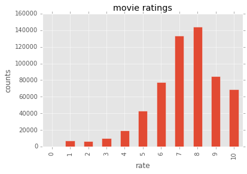
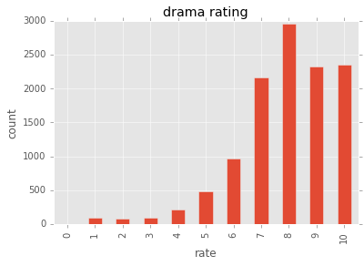

```python
%matplotlib inline
import matplotlib.pyplot as plt
import numpy as np
import pandas as pd
```


```python
plt.style.use('ggplot')
```


```python
print(plt.style.available)
```

    [u'seaborn-darkgrid', u'seaborn-notebook', u'classic', u'seaborn-ticks', u'grayscale', u'bmh', u'seaborn-talk', u'dark_background', u'ggplot', u'fivethirtyeight', u'seaborn-colorblind', u'seaborn-deep', u'seaborn-whitegrid', u'seaborn-bright', u'seaborn-poster', u'seaborn-muted', u'seaborn-paper', u'seaborn-white', u'seaborn-pastel', u'seaborn-dark', u'seaborn-dark-palette']


```python
# dataset from https://github.com/sidooms/MovieTweetings
cols = ['user id', 'movie id', 'rate', 'ts']
ratings = pd.read_csv('dataset/ratings.dat.txt', sep='::', 
                      index_col=False, names=cols, encoding='utf8')
```

    /Users/kris/anaconda/lib/python2.7/site-packages/ipykernel/__main__.py:3: ParserWarning: Falling back to the 'python' engine because the 'c' engine does not support regex separators (separators > 1 char and different from '\s+' are interpreted as regex); you can avoid this warning by specifying engine='python'.
      app.launch_new_instance()


```python
ratings[:5]
```


<div>
<table border="1" class="dataframe">
  <thead>
    <tr style="text-align: right;">
      <th></th>
      <th>user id</th>
      <th>movie id</th>
      <th>rate</th>
      <th>ts</th>
    </tr>
  </thead>
  <tbody>
    <tr>
      <th>0</th>
      <td>1</td>
      <td>68646</td>
      <td>10</td>
      <td>1381620027</td>
    </tr>
    <tr>
      <th>1</th>
      <td>1</td>
      <td>113277</td>
      <td>10</td>
      <td>1379466669</td>
    </tr>
    <tr>
      <th>2</th>
      <td>2</td>
      <td>422720</td>
      <td>8</td>
      <td>1412178746</td>
    </tr>
    <tr>
      <th>3</th>
      <td>2</td>
      <td>454876</td>
      <td>8</td>
      <td>1394818630</td>
    </tr>
    <tr>
      <th>4</th>
      <td>2</td>
      <td>790636</td>
      <td>7</td>
      <td>1389963947</td>
    </tr>
  </tbody>
</table>
</div>


```python
ratings['rate'].value_counts()
```


    8     144125
    7     133613
    9      84679
    6      77757
    10     69018
    5      42972
    4      19212
    3      10377
    1       7138
    2       6164
    0        141
    Name: rate, dtype: int64


```python
ratings['rate'].value_counts().sort_index().plot(kind='bar')
plt.title('movie ratings')
plt.ylabel('counts')
plt.xlabel('rate')

```


    <matplotlib.text.Text at 0x11e08f090>





```python
movies = pd.read_csv('dataset/movies.dat.txt', sep='::', 
                     index_col=False, names=['movie id', 'name', 'genre'], 
                     encoding='utf8')
movies[:5]
```

    /Users/kris/anaconda/lib/python2.7/site-packages/ipykernel/__main__.py:3: ParserWarning: Falling back to the 'python' engine because the 'c' engine does not support regex separators (separators > 1 char and different from '\s+' are interpreted as regex); you can avoid this warning by specifying engine='python'.
      app.launch_new_instance()


<div>
<table border="1" class="dataframe">
  <thead>
    <tr style="text-align: right;">
      <th></th>
      <th>movie id</th>
      <th>name</th>
      <th>genre</th>
    </tr>
  </thead>
  <tbody>
    <tr>
      <th>0</th>
      <td>8</td>
      <td>Edison Kinetoscopic Record of a Sneeze (1894)</td>
      <td>Documentary|Short</td>
    </tr>
    <tr>
      <th>1</th>
      <td>10</td>
      <td>La sortie des usines Lumière (1895)</td>
      <td>Documentary|Short</td>
    </tr>
    <tr>
      <th>2</th>
      <td>12</td>
      <td>The Arrival of a Train (1896)</td>
      <td>Documentary|Short</td>
    </tr>
    <tr>
      <th>3</th>
      <td>25</td>
      <td>The Oxford and Cambridge University Boat Race ...</td>
      <td>NaN</td>
    </tr>
    <tr>
      <th>4</th>
      <td>91</td>
      <td>Le manoir du diable (1896)</td>
      <td>Short|Horror</td>
    </tr>
  </tbody>
</table>
</div>


```python
drama = movies[movies['genre'] =='Crime|Drama']
drama[:5]
```


<div>
<table border="1" class="dataframe">
  <thead>
    <tr style="text-align: right;">
      <th></th>
      <th>movie id</th>
      <th>name</th>
      <th>genre</th>
    </tr>
  </thead>
  <tbody>
    <tr>
      <th>15</th>
      <td>2844</td>
      <td>Fantômas - À l'ombre de la guillotine (1913)</td>
      <td>Crime|Drama</td>
    </tr>
    <tr>
      <th>215</th>
      <td>20859</td>
      <td>Escape! (1930)</td>
      <td>Crime|Drama</td>
    </tr>
    <tr>
      <th>229</th>
      <td>21406</td>
      <td>Sono yo no tsuma (1930)</td>
      <td>Crime|Drama</td>
    </tr>
    <tr>
      <th>261</th>
      <td>22286</td>
      <td>The Public Enemy (1931)</td>
      <td>Crime|Drama</td>
    </tr>
    <tr>
      <th>264</th>
      <td>22403</td>
      <td>Smart Money (1931)</td>
      <td>Crime|Drama</td>
    </tr>
  </tbody>
</table>
</div>


```python
dramaIds = drama['movie id']
criterion = ratings['movie id'].map(lambda x: (dramaIds==x).any())
dramaRates = ratings[criterion]
dramaRates[:5]
```


<div>
<table border="1" class="dataframe">
  <thead>
    <tr style="text-align: right;">
      <th></th>
      <th>user id</th>
      <th>movie id</th>
      <th>rate</th>
      <th>ts</th>
    </tr>
  </thead>
  <tbody>
    <tr>
      <th>0</th>
      <td>1</td>
      <td>68646</td>
      <td>10</td>
      <td>1381620027</td>
    </tr>
    <tr>
      <th>50</th>
      <td>15</td>
      <td>68646</td>
      <td>10</td>
      <td>1486459236</td>
    </tr>
    <tr>
      <th>51</th>
      <td>15</td>
      <td>71562</td>
      <td>10</td>
      <td>1486459311</td>
    </tr>
    <tr>
      <th>52</th>
      <td>15</td>
      <td>99674</td>
      <td>9</td>
      <td>1486459399</td>
    </tr>
    <tr>
      <th>104</th>
      <td>27</td>
      <td>111161</td>
      <td>10</td>
      <td>1405022004</td>
    </tr>
  </tbody>
</table>
</div>


```python
dramaRates['rate'].value_counts().sort_index().plot(kind='bar')
plt.title('drama rating')
plt.xlabel('rate')
plt.ylabel('count')
```


    <matplotlib.text.Text at 0x11e024790>





```python
ratings.shape, movies.shape
```


    ((595196, 4), (27565, 3))


```python

```
