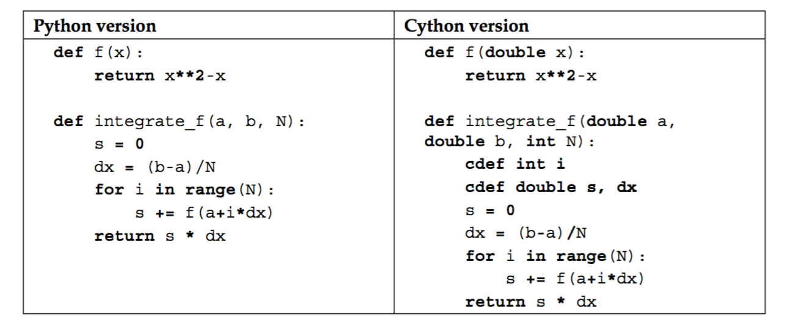

# Performant Python Guide

## Profiling
**Tools**:
- [cProfile](https://docs.python.org/2/library/profile.html)
    + comes by default with the standard Python interpreter (cPython) since version 2.5
    + exclusively measures CPU time
    + pays no attention to memory consumption and other memory related stats
    + main APIs:
        * run(command, filename=None, sort=-1)
        * exec(command, \_\_main\_\_.\_\_dict\_\_, \_\_main\_\_.\_\_dict\_\_)
        * runctx(command, globals, locals, filename=None)
    
    ```python
    # *** PROFILER RESULTS ***
    # fib_ver1 (XXXX\tmp\profile_examples\main.py:5)
    # function called 109 times
    #
    #          326 function calls (6 primitive calls) in 0.000 seconds
    #
    #    Ordered by: cumulative time, internal time, call count
    #
    #    ncalls  tottime  percall  cumtime  percall filename:lineno(function)
    #     109/1    0.000    0.000    0.000    0.000 main.py:5(fib_ver1)
    #     108/2    0.000    0.000    0.000    0.000 profilehooks.py:235(new_fn)
    #     108/2    0.000    0.000    0.000    0.000 profilehooks.py:329(__call__)
    #         1    0.000    0.000    0.000    0.000 {method 'disable' of '_lsprof.Profiler' objects}
    #         0    0.000             0.000          profile:0(profiler)
    ```

    | column name | meaning |
    | ----------- | ------- |
    | ncalls | reports the number of calls to the function. If there are two numbers in this column, it means there was recursion. The second one is the number of primitive calls, and the first one is the total number of calls. This number can be helpful to identify the possible bugs (unexpected high numbers) or possible inline expansion points.) |
    | tottime | the total time spent inside the function (excluding the time spent doing subcalls to other functions). This particular information can help the developer find long running loops that could be optimized. |
    | percall | the quotient of tottime divided by ncalls. |
    | cumtime | the cumulative time spent inside the function including the time spent in subfunctions (this includes recursive calls as well). This number could help identify higher level errors, such as those in the selection of the algorithm. |
    | percall | the quotient of cumtime divided by primitive calls. |
    | filename:lineno(function) |  the file name, line number, and function name of the analyzed function. |

- [line_profiler](https://github.com/rkern/line_profiler)
    + pip install line_profiler
    + The profiler was designed to be used as a decorator
    + execute the profiler: kernprof -l script_to_profile.py
    
    

- [RunSnakeRun](http://www.vrplumber.com/programming/runsnakerun/)
    + a small GUI utility that allows you to view (Python) cProfile or Profile profiler dumps in a sortable GUI view.
    + installation:
        ```sh
        apt-get install python-profiler python-wxgtk2.8 python-setuptools
        pip install  SquareMap RunSnakeRun
        ```
    + run:
        ```sh
        python -m cProfile -o xxx.prof xxx.py \<paras\>
        ```
    
    

## Tips and tricks of Python
- Memoization / lookup tables
- Usage of default arguments
    ```python
    import math 
    #original function
    def degree_sin(deg):
        return math.sin(deg * math.pi / 180.0)
    #optimized function, the factor variable is calculated during function 
    creation time, 
    #and so is the lookup of the math.sin method.
    def degree_sin(deg, factor=math.pi/180.0, sin=math.sin):
        return sin(deg * factor)
    ```
- List comprehension and generators
    + dis module to show the bytecode
    + when generating a list, the for loop should not be your weapon of choice.
    + when generating big lists, consider using generators.
    
    

- ctypes
    + allows the developer to reach under the hood of Python and tap into the power of the C language.
- String concatenation
    + In Python, strings are immutable, which means that once you create one you can't really change its value.
    + variable interpolation
    + join
- Membership testing
    + set and dict
- collections
- funcion calls can be expensive
- When possible, sort by the key, instead of assign a cmp
- 1 is better than True
- Multiple assignments are slow
- Chained comparisons are good
- Using namedtuples instead of regular (small) objects

## Multithreading & multiprocessint
- Multithreading
    + benefits
        * Responsiveness
        * Faster execution
        * Lower resource consumption
        * Simplified sharing and communication
        * Parallelization
    + drawbacks
        * Thread synchronization
        * Crash due to problematic thread
        * Deadlocks
    + GIL
        * The official version of Python (CPython) has a limitation called GIL. This GIL prevents multiple native threads from running Python's bytecode at once, which effectively trumps parallelism.
        * A GIL is necessary because the memory management in CPython is not thread safe.
    +  modules in python
        * The thread module: This provides some limited ability to work with threads. It's simple to use, and for small tasks, it adds little overhead.
        * The threading module: This is newer and included in Python since version 2.4. It provides a more powerful and higher level support for threads.
        * Interthread communication using events

        | use threads | do not use threads |
        | ----------- | ------------------ |
        | For heavy IO-bound scripts| To optimize scripts that are heavily CPU bound |
        | When parallelism can be replaced by concurrency | For programs that must take advantage of multicore systems |
        | For GUI development | |
- Multiprocessing

    | Adventages | Disadventages |
    | ---------- | ------------- |
    | Takes advantage of multicore systems | Larger memory footprint |
    | Separate memory space removes race conditions from the equation | Harder to share mutable data between processes |
    | Child processes are easily interruptible (killable) | Interprocess communication (IPC) is harder than with threads |
    | Avoids the GIL limitation (although only in the case of CPython) | |

    + Pool class, which represents a pool of worker processes that facilitate different ways to execute a set of tasks in subprocesses, main apis:
        * apply
        * apply_async
        * map
    
    + Interprocess communication
        * The Queue class provides a thread-safe and process-safe first-in-first-out (FIFO) mechanism to exchange data.
        * Pipes provide a bidirectional channel of communication between two processes. The Pipe() function returns a pair of connection objects, each representing one side of the pipe. Each connection object has both a send() and a recv() method.
        * Events. Event objects can't be passed into worker functions. If you try to do that, a runtime error will be issued, saying that semaphore objects can only be shared between processes through inheritance.

## PyPy & Cython
- PyPy, which consists of a version of Python and is implemented in RPython. It has a JIT compiler in charge of optimizing the code during execution time.
- Cython, which is basically a transpiler of (static typing) Python code into C code.
    

| pypy use cases | cython use cases |
| -------------- | ---------------- |
| You're not dealing with an execute once script. | You're familiar with C code. |
| Full support of third-party libraries is not required. | Losing Python's readability is not a problem. |
| You need your code to be compatible with CPython. | Full support of the Python language is needed. |

**References:**
- Mastering Python High Performance
