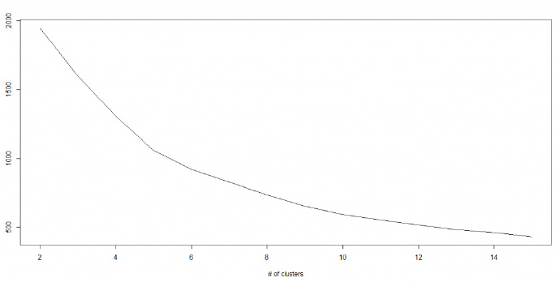

# Introduction to Machine Learning in Python

## Three ML approaches
- Supervised Learning
    算法由一个目标变量或结果变量（或因变量）组成。这些变量由已知的一系列预示变量（自变量）预测而来。利用这一系列变量，我们生成一个将输入值映射到期望输出值的函数。这个训练过程会一直持续，直到模型在训练数据上获得期望的精确度。监督式学习的例子有：回归、决策树、随机森林、K – 近邻算法、逻辑回归等。

- Unsupervised Learning
    在这类算法中，没有任何目标变量或结果变量要预测或估计。这个算法用在不同的组内聚类分析。这种分析方式被广泛地用来细分客户，根据干预的方式分为不同的用户组。非监督式学习的例子有：关联算法和 K – 均值算法。

- Reenforced Learning
    这类算法训练机器进行决策。它是这样工作的：机器被放在一个能让它通过反复试错来训练自己的环境中。机器从过去的经验中进行学习，并且尝试利用了解最透彻的知识作出精确的商业判断。 强化学习的例子有马尔可夫决策过程。

## Classic learning algorithms
- 线性回归
    + 线性回归通常用于根据连续变量估计实际数值（房价、呼叫次数、总销售额等）。我们通过拟合最佳直线来建立自变量和因变量的关系。这条最佳直线叫做回归线，并且用 Y= a *X + b 这条线性等式来表示。
    + 线性回归的两种主要类型是一元线性回归和多元线性回归。一元线性回归的特点是只有一个自变量。多元线性回归的特点正如其名，存在多个自变量。找最佳拟合直线的时候，你可以拟合到多项或者曲线回归。这些就被叫做多项或曲线回归。
    
    ```python
    #Import Library
    #Import other necessary libraries like pandas, numpy...
    from sklearn import linear_model
     
    #Load Train and Test datasets
    #Identify feature and response variable(s) and values must be numeric and numpy arrays
    x_train=input_variables_values_training_datasets
    y_train=target_variables_values_training_datasets
    x_test=input_variables_values_test_datasets
     
    # Create linear regression object
    linear = linear_model.LinearRegression()
     
    # Train the model using the training sets and check score
    linear.fit(x_train, y_train)
    linear.score(x_train, y_train)
     
    #Equation coefficient and Intercept
    print('Coefficient: n', linear.coef_)
    print('Intercept: n', linear.intercept_)
     
    #Predict Output
    predicted= linear.predict(x_test)
    ```

    

- 逻辑回归
    + 别被它的名字迷惑了！这是一个分类算法而不是一个回归算法。该算法可根据已知的一系列因变量估计离散数值（比方说二进制数值 0 或 1 ，是或否，真或假）。简单来说，它通过将数据拟合进一个逻辑函数来预估一个事件出现的概率。因此，它也被叫做逻辑回归。因为它预估的是概率，所以它的输出值大小在 0 和 1 之间（正如所预计的一样）。
    + 假设你的朋友让你解开一个谜题。这只会有两个结果：你解开了或是你没有解开。想象你要解答很多道题来找出你所擅长的主题。这个研究的结果就会像是这样：假设题目是一道十年级的三角函数题，你有 70%的可能会解开这道题。然而，若题目是个五年级的历史题，你只有30%的可能性回答正确。这就是逻辑回归能提供给你的信息。
    + 从数学上看，在结果中，几率的对数使用的是预测变量的线性组合模型。
    
    ```
    odds= p/ (1-p) = probability of event occurrence / probability of not event occurrence
    ln(odds) = ln(p/(1-p))
    logit(p) = ln(p/(1-p)) = b0+b1X1+b2X2+b3X3....+bkXk
    ```

    + 在上面的式子里，p 是我们感兴趣的特征出现的概率。它选用使观察样本值的可能性最大化的值作为参数，而不是通过计算误差平方和的最小值(就如一般的回归分析用到的一样)。现在你也许要问了，为什么我们要求出对数呢？简而言之，这种方法是复制一个阶梯函数的最佳方法之一。我本可以更详细地讲述，但那就违背本篇指南的主旨了。

    ```python
    #Import Library
    from sklearn.linear_model import LogisticRegression
    #Assumed you have, X (predictor) and Y (target) for training data set and x_test(predictor) of test_dataset
    # Create logistic regression object
    model = LogisticRegression()
     
    # Train the model using the training sets and check score
    model.fit(X, y)
    model.score(X, y)
     
    #Equation coefficient and Intercept
    print('Coefficient: n', model.coef_)
    print('Intercept: n', model.intercept_)
     
    #Predict Output
    predicted= model.predict(x_test)
    ```

    

- 决策树
    + 监督式学习算法
    + 被用于分类问题
    + 同时适用于离散变量和连续变量
    + [A Complete Tutorial on Tree Based Modeling from Scratch (in R & Python)](https://www.analyticsvidhya.com/blog/2016/04/complete-tutorial-tree-based-modeling-scratch-in-python/)
    + Advantages:
        * Easy to Understand & Interpret
        * Useful in Data exploration
            Decision tree is one of the fastest way to identify most significant variables and relation between two or more variables.
        * Less data cleaning required
        * It is not influenced by outliers and missing values to a fair degree.
        * Data type is not a constraint: It can handle both numerical and categorical variables.
        * Non Parametric Method: decision trees have no assumptions about the space distribution and the classifier structure.
    + Disadvantages:
        * Overfitting
            Solutions:
            - Setting constraints on tree size
                + Minimum samples for a node split
                + Minimum samples for a terminal node (leaf)
                + Maximum depth of tree (vertical depth)
                + Maximum number of terminal nodes
                + Maximum features to consider for split
            - Tree pruning
                + Unlike greedy setting constraints approach, if we use pruning, we in effect look at a few steps ahead and make a choice.
                + sklearn’s decision tree classifier does not currently support pruning.
        * Not fit for continuous variables
    + When to use:
        * If the relationship between dependent & independent variable is well approximated by a linear model, linear regression will outperform tree based model.
        * If there is a high non-linearity & complex relationship between dependent & independent variables, a tree model will outperform a classical regression method.
        * If you need to build a model which is easy to explain to people, a decision tree model will always do better than a linear model. Decision tree models are even simpler to interpret than linear regression!

    ```python
    #Import Library
    #Import other necessary libraries like pandas, numpy...
    from sklearn import tree
     
    #Assumed you have, X (predictor) and Y (target) for training data set and x_test(predictor) of test_dataset
    # Create tree object 
    model = tree.DecisionTreeClassifier(criterion='gini') # for classification, here you can change the algorithm as gini or entropy (information gain) by default it is gini  
     
    # model = tree.DecisionTreeRegressor() for regression
    # Train the model using the training sets and check score
    model.fit(X, y)
    model.score(X, y)
     
    #Predict Output
    predicted= model.predict(x_test)
    ```

- SVM
    + 这是一种分类方法
    + 在这个算法中，我们将每个数据在N维空间中用点标出（N是你所有的特征总数），每个特征的值是一个坐标的值。
    + 举个例子，如果我们只有身高和头发长度两个特征，我们会在二维空间中标出这两个变量，每个点有两个坐标（这些坐标叫做支持向量）:
        
        

        现在，我们会找到将两组不同数据分开的一条直线。在这里，我们的目标是找到一条将两组数据分开的直线，使得最靠近此直线的点的距离最大化：

        

        上面示例中的黑线将数据分类优化成两个小组，两组中距离最近的点（图中A、B点）到达黑线的距离满足最优条件。这条直线就是我们的分割线。接下来，测试数据落到直线的哪一边，我们就将它分到哪一类去。

        ```python
        #Import Library
        from sklearn import svm
         
        #Assumed you have, X (predictor) and Y (target) for training data set and x_test(predictor) of test_dataset
        # Create SVM classification object 
        model = svm.svc() # there is various option associated with it, this is simple for classification.
        # Train the model using the training sets and check score
        model.fit(X, y)
        model.score(X, y)
         
        #Predict Output
        predicted= model.predict(x_test)
        ```

- 朴素贝叶斯
    + 一个朴素贝叶斯分类器假设一个分类的特性与该分类的其它特性不相关。
    + 举个例子，如果一个水果又圆又红，并且直径大约是 3 英寸，那么这个水果可能会是苹果。即便这些特性互相依赖，或者依赖于别的特性的存在，朴素贝叶斯分类器还是会假设这些特性分别独立地暗示这个水果是个苹果。
    + 朴素贝叶斯模型易于建造，且对于大型数据集非常有用。虽然简单，但是朴素贝叶斯的表现却超越了非常复杂的分类方法。
    + 这个算法通常被用于文本分类，以及涉及到多个类的问题。

    

    + P(c|x) 是已知预示变量（属性）的前提下，类（目标）的后验概率
    + P(c) 是类的先验概率
    + P(x|c) 是可能性，即已知类的前提下，预示变量的概率
    + P(x) 是预示变量的先验概率

    ```python
    #Import Library
    from sklearn.naive_bayes import GaussianNB
     
    #Assumed you have, X (predictor) and Y (target) for training data set and x_test(predictor) of test_dataset
    # Create NB classification object 
    model = GaussianNB() # there is other distribution for multinomial classes like Bernoulli Naive Bayes
    # Train the model using the training sets and check score
    model.fit(X, y)
     
    #Predict Output
    predicted= model.predict(x_test)
    ```

- K最近邻算法
    + 可用于分类问题和回归问题。然而，在业界内，K – 最近邻算法更常用于分类问题。
    + 它储存所有的案例，通过周围k个案例中的大多数情况划分新的案例。根据一个距离函数，新案例会被分配到它的 K 个近邻中最普遍的类别中去。
    + 这些距离函数可以是欧式距离、曼哈顿距离、明式距离或者是汉明距离。前三个距离函数用于连续函数，第四个函数（汉明函数）则被用于分类变量。
    + 使用 KNN 建模时，选择 K 的取值是一个挑战。
    + KNN 的计算成本很高。(instance-based classification)
    + 变量应该先标准化（normalized），不然会被更高范围的变量偏倚。
    + 在使用KNN之前，要在野值去除和噪音去除等前期处理多花功夫。
    
    ```python
    from sklearn.neighbors import KNeighborsClassifier
    #Assumed you have, X (predictor) and Y (target) for training data set and x_test(predictor) of test_dataset
    # Create KNeighbors classifier object 
    model = KNeighborsClassifier(n_neighbors=6) # default value for n_neighbors is 5  
    # Train the model using the training sets and check score
    model.fit(X, y) 
    #Predict Output
    predicted= model.predict(x_test)
    ```

- K均值算法
    + Unsupervised clustering algorithm:
        1. K – 均值算法给每个集群选择k个点。这些点称作为质心。
        2. 每一个数据点与距离最近的质心形成一个集群，也就是 k 个集群。
        3. 根据现有的类别成员，找出每个类别的质心。现在我们有了新质心。
        4. 当我们有新质心后，重复步骤 2 和步骤 3。找到距离每个数据点最近的质心，并与新的k集群联系起来。重复这个过程，直到数据都收敛了，也就是当质心不再改变。
    + K selection:
        * K – 均值算法涉及到集群，每个集群有自己的质心。一个集群内的质心和各数据点之间距离的平方和形成了这个集群的平方值之和。同时，当所有集群的平方值之和加起来的时候，就组成了集群方案的平方值之和。
        * 我们知道，当集群的数量增加时，K值会持续下降。但是，如果你将结果用图表来表示，你会看到距离的平方总和快速减少。到某个值 k 之后，减少的速度就大大下降了。在此，我们可以找到集群数量的最优值。

        

    ```python
    from sklearn.cluster import KMeans
    #Assumed you have, X (attributes) for training data set and x_test(attributes) of test_dataset
    # Create KMeans model 
    model = KMeans(n_clusters=3, random_state=0)   
    # Train the model using the training sets and check score
    model.fit(X)   
    #Predict Output
    predicted= model.predict(x_test)
    ```
    
- 随机森林算法
    + 在随机森林算法中，我们有一系列的决策树（因此又名“森林”）。
    + 为了根据一个新对象的属性将其分类，每一个决策树有一个分类，称之为这个决策树“投票”给该分类。这个森林选择获得森林里（在所有树中）获得票数最多的分类(bagging)。
    + 每棵树是像这样种植养成的：
        * 如果训练集的案例数是 N，则从 N 个案例中用重置抽样法随机抽取样本。这个样本将作为“养育”树的训练集。
        * 假如有 M 个输入变量，则定义一个数字 m<<M。m 表示，从 M 中随机选中 m 个变量，这 m 个变量中最好的切分会被用来切分该节点。在种植森林的过程中，m 的值保持不变。
        * 尽可能大地种植每一棵树，全程不剪枝。
    + Advantages of Random Forest:
        * This algorithm **can solve both type of problems i.e. classification and regression** and does a decent estimation at both fronts.
        * One of benefits of Random forest which excites me most is, the power of **handle large data set with higher dimensionality**. It can handle thousands of input variables and **identify most significant variables** so it **is considered as one of the dimensionality reduction methods**.
        * It has an effective method for estimating missing data and maintains accuracy when a large proportion of the data are missing.
        * It has methods for balancing errors in data sets where classes are imbalanced.
        * The capabilities of the above can be extended to unlabeled data, leading to unsupervised clustering, data views and outlier detection.
    + Disadvantages of Random Forest:
        * It surely does a good job at classification but not as good as for regression problem as it does not give precise continuous nature predictions.
        * Random Forest can feel like a black box approach for statistical modelers – you have very little control on what the model does. You can at best – try different parameters and random seeds!

    ```python
    #Import Library
    from sklearn.ensemble import RandomForestClassifier
    #Assumed you have, X (predictor) and Y (target) for training data set and x_test(predictor) of test_dataset
    # Create Random Forest object
    model= RandomForestClassifier()
    # Train the model using the training sets and check score
    model.fit(X, y)
    #Predict Output
    predicted= model.predict(x_test)
    ```

- 降维算法
    + Dimension Reduction refers to the process of converting a set of data having vast dimensions into data with lesser dimensions ensuring that it conveys similar information concisely.
    + 作为一个数据科学家，我们提供的数据包含许多特点。这听起来给建立一个经得起考研的模型提供了很好材料，但有一个挑战：如何从 1000 或者 2000 里分辨出最重要的变量呢？在这种情况下，降维算法和别的一些算法（比如决策树、随机森林、PCA、因子分析）帮助我们根据相关矩阵，缺失的值的比例和别的要素来找出这些重要变量。
    + the benefits of Dimension Reduction:
        * It helps in data compressing and reducing the storage space required
        * It fastens the time required for performing same computations.
        * It takes care of multi-collinearity that improves the model performance. It removes redundant features. 
        * Reducing the dimensions of data to 2D or 3D may allow us to plot and visualize it precisely.
        * It is helpful in noise removal.
    + common methods to perform Dimension Reduction:
        * drop the variable if it has more than ~40-50% __missing values__.
        * drop variables having __low variance__ compared to others
        * __Decision Trees__: It can be used as a ultimate solution to tackle multiple challenges like missing values, outliers and identifying significant variables.
        * __Random Forest__: Similar to decision tree is Random Forest. I would also recommend using the in-built feature importance provided by random forests to select a smaller subset of input features. Just be careful that random forests have a tendency to bias towards variables that have more no. of distinct values i.e. favor numeric variables over binary/categorical values.
        * __High Correlation__: Dimensions exhibiting higher correlation can lower down the performance of model.Moreover, it is not good to have multiple variables of similar information or variation also known as __“Multicollinearity”__. You can use __Pearson (continuous variables)__ or __Polychoric (discrete variables) correlation matrix__ to identify the variables with high correlation and select one of them using __VIF (Variance Inflation Factor)__. Variables having higher value ( VIF > 5 ) can be dropped.
        * __Backward Feature Elimination__: In this method, we start with all n dimensions. Compute the __sum of square of error (SSR)__ after eliminating each variable (n times). Then, identifying variables whose removal has produced the smallest increase in the SSR and removing it finally, leaving us with n-1 input features. Repeat this process until no other variables can be dropped. Reverse to this, we can use “__Forward Feature Selection__” method. In this method, we select one variable and analyse the performance of model by adding another variable.
        * __Factor Analysis__: Let’s say some variables are highly correlated. These variables can be grouped by their correlations i.e. all variables in a particular group can be highly correlated among themselves but have low correlation with variables of other group(s). Here each group represents a single underlying construct or factor. These factors are small in number as compared to large number of dimensions. However, these factors are difficult to observe. There are basically two methods of performing factor analysis:
            - EFA (Exploratory Factor Analysis)
            - CFA (Confirmatory Factor Analysis)
        * __Principal Component Analysis (PCA)__: In this technique, variables are transformed into a new set of variables, which are linear combination of original variables. These new set of variables are known as principle components. They are obtained in such a way that first principle component accounts for most of the possible variation of original data after which each succeeding component has the highest possible variance.The second principal component must be orthogonal to the first principal component. In other words, it does its best to capture the variance in the data that is not captured by the first principal component. For two-dimensional dataset, there can be only two principal components. Below is a snapshot of the data and its first and second principal components. You can notice that second principle component is orthogonal to first principle component.The principal components are sensitive to the scale of measurement, now to fix this issue we should __always standardize variables before applying PCA__. __Applying PCA to your data set loses its meaning__. If interpretability of the results is important for your analysis, PCA is not the right technique for your project.
    
    ```python
    #Import Library
    from sklearn import decomposition
     
    #Assumed you have training and test data set as train and test
    # Create PCA obeject pca= decomposition.PCA(n_components=k) #default value of k =min(n_sample, n_features)
    # For Factor analysis
    #fa= decomposition.FactorAnalysis()
    # Reduced the dimension of training dataset using PCA
    train_reduced = pca.fit_transform(train)
     
    #Reduced the dimension of test dataset
    test_reduced = pca.transform(test)
    ```

- Gradient Boost 和 Adaboost 算法

**Reference**
- [common-machine-learning-algorithms](https://www.analyticsvidhya.com/blog/2015/08/common-machine-learning-algorithms/)
- [10 种机器学习算法的要点](http://blog.jobbole.com/92021/)
- [complete-tutorial-tree-based-modeling-scratch-in-python](https://www.analyticsvidhya.com/blog/2016/04/complete-tutorial-tree-based-modeling-scratch-in-python/)
- [support-vector-machine-simplified](https://www.analyticsvidhya.com/blog/2014/10/support-vector-machine-simplified/)
