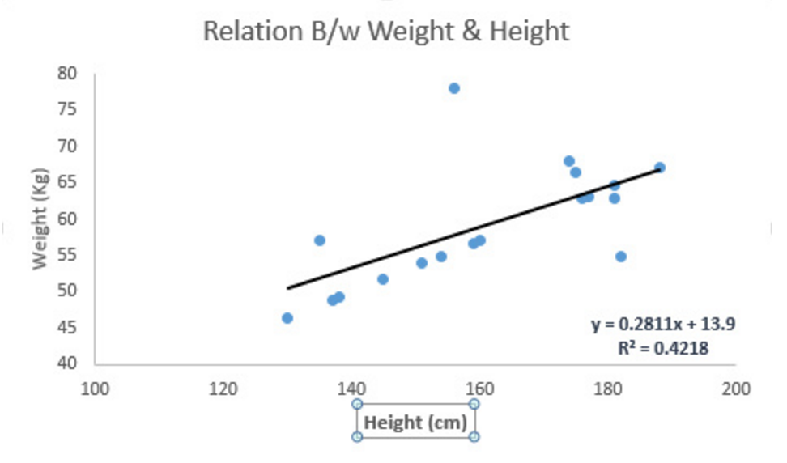
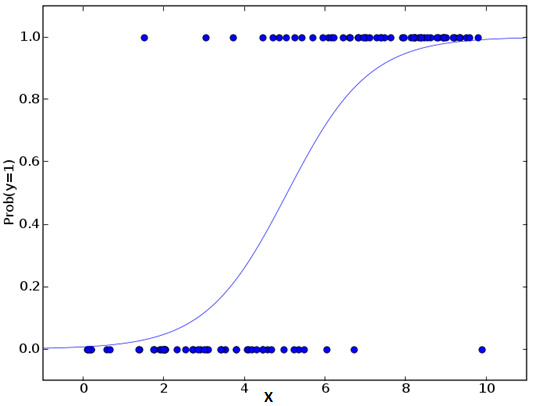
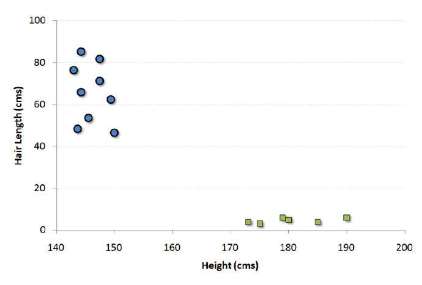
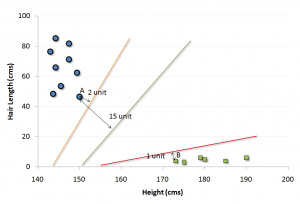
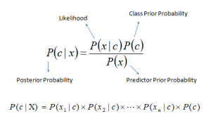

# Introduction to Machine Learning in Python

## Three ML approaches
- Supervised Learning
    算法由一个目标变量或结果变量（或因变量）组成。这些变量由已知的一系列预示变量（自变量）预测而来。利用这一系列变量，我们生成一个将输入值映射到期望输出值的函数。这个训练过程会一直持续，直到模型在训练数据上获得期望的精确度。监督式学习的例子有：回归、决策树、随机森林、K – 近邻算法、逻辑回归等。

- Unsupervised Learning
    在这类算法中，没有任何目标变量或结果变量要预测或估计。这个算法用在不同的组内聚类分析。这种分析方式被广泛地用来细分客户，根据干预的方式分为不同的用户组。非监督式学习的例子有：关联算法和 K – 均值算法。

- Reenforced Learning
    这类算法训练机器进行决策。它是这样工作的：机器被放在一个能让它通过反复试错来训练自己的环境中。机器从过去的经验中进行学习，并且尝试利用了解最透彻的知识作出精确的商业判断。 强化学习的例子有马尔可夫决策过程。

## Classic learning algorithms
- 线性回归
    + 线性回归通常用于根据连续变量估计实际数值（房价、呼叫次数、总销售额等）。我们通过拟合最佳直线来建立自变量和因变量的关系。这条最佳直线叫做回归线，并且用 Y= a *X + b 这条线性等式来表示。
    + 线性回归的两种主要类型是一元线性回归和多元线性回归。一元线性回归的特点是只有一个自变量。多元线性回归的特点正如其名，存在多个自变量。找最佳拟合直线的时候，你可以拟合到多项或者曲线回归。这些就被叫做多项或曲线回归。
    
    ```python
    #Import Library
    #Import other necessary libraries like pandas, numpy...
    from sklearn import linear_model
     
    #Load Train and Test datasets
    #Identify feature and response variable(s) and values must be numeric and numpy arrays
    x_train=input_variables_values_training_datasets
    y_train=target_variables_values_training_datasets
    x_test=input_variables_values_test_datasets
     
    # Create linear regression object
    linear = linear_model.LinearRegression()
     
    # Train the model using the training sets and check score
    linear.fit(x_train, y_train)
    linear.score(x_train, y_train)
     
    #Equation coefficient and Intercept
    print('Coefficient: n', linear.coef_)
    print('Intercept: n', linear.intercept_)
     
    #Predict Output
    predicted= linear.predict(x_test)
    ```

    

- 逻辑回归
    + 别被它的名字迷惑了！这是一个分类算法而不是一个回归算法。该算法可根据已知的一系列因变量估计离散数值（比方说二进制数值 0 或 1 ，是或否，真或假）。简单来说，它通过将数据拟合进一个逻辑函数来预估一个事件出现的概率。因此，它也被叫做逻辑回归。因为它预估的是概率，所以它的输出值大小在 0 和 1 之间（正如所预计的一样）。
    + 假设你的朋友让你解开一个谜题。这只会有两个结果：你解开了或是你没有解开。想象你要解答很多道题来找出你所擅长的主题。这个研究的结果就会像是这样：假设题目是一道十年级的三角函数题，你有 70%的可能会解开这道题。然而，若题目是个五年级的历史题，你只有30%的可能性回答正确。这就是逻辑回归能提供给你的信息。
    + 从数学上看，在结果中，几率的对数使用的是预测变量的线性组合模型。
    
    ```
    odds= p/ (1-p) = probability of event occurrence / probability of not event occurrence
    ln(odds) = ln(p/(1-p))
    logit(p) = ln(p/(1-p)) = b0+b1X1+b2X2+b3X3....+bkXk
    ```

    + 在上面的式子里，p 是我们感兴趣的特征出现的概率。它选用使观察样本值的可能性最大化的值作为参数，而不是通过计算误差平方和的最小值(就如一般的回归分析用到的一样)。现在你也许要问了，为什么我们要求出对数呢？简而言之，这种方法是复制一个阶梯函数的最佳方法之一。我本可以更详细地讲述，但那就违背本篇指南的主旨了。

    ```python
    #Import Library
    from sklearn.linear_model import LogisticRegression
    #Assumed you have, X (predictor) and Y (target) for training data set and x_test(predictor) of test_dataset
    # Create logistic regression object
    model = LogisticRegression()
     
    # Train the model using the training sets and check score
    model.fit(X, y)
    model.score(X, y)
     
    #Equation coefficient and Intercept
    print('Coefficient: n', model.coef_)
    print('Intercept: n', model.intercept_)
     
    #Predict Output
    predicted= model.predict(x_test)
    ```

    

- 决策树
    + 监督式学习算法
    + 被用于分类问题
    + 同时适用于离散变量和连续变量
    + [A Complete Tutorial on Tree Based Modeling from Scratch (in R & Python)](https://www.analyticsvidhya.com/blog/2016/04/complete-tutorial-tree-based-modeling-scratch-in-python/)
    + Advantages:
        * Easy to Understand & Interpret
        * Useful in Data exploration
            Decision tree is one of the fastest way to identify most significant variables and relation between two or more variables.
        * Less data cleaning required
        * It is not influenced by outliers and missing values to a fair degree.
        * Data type is not a constraint: It can handle both numerical and categorical variables.
        * Non Parametric Method: decision trees have no assumptions about the space distribution and the classifier structure.
    + Disadvantages:
        * Overfitting
            Solutions:
            - Setting constraints on tree size
                + Minimum samples for a node split
                + Minimum samples for a terminal node (leaf)
                + Maximum depth of tree (vertical depth)
                + Maximum number of terminal nodes
                + Maximum features to consider for split
            - Tree pruning
                + Unlike greedy setting constraints approach, if we use pruning, we in effect look at a few steps ahead and make a choice.
                + sklearn’s decision tree classifier does not currently support pruning.
        * Not fit for continuous variables
    + When to use:
        * If the relationship between dependent & independent variable is well approximated by a linear model, linear regression will outperform tree based model.
        * If there is a high non-linearity & complex relationship between dependent & independent variables, a tree model will outperform a classical regression method.
        * If you need to build a model which is easy to explain to people, a decision tree model will always do better than a linear model. Decision tree models are even simpler to interpret than linear regression!

    ```python
    #Import Library
    #Import other necessary libraries like pandas, numpy...
    from sklearn import tree
     
    #Assumed you have, X (predictor) and Y (target) for training data set and x_test(predictor) of test_dataset
    # Create tree object 
    model = tree.DecisionTreeClassifier(criterion='gini') # for classification, here you can change the algorithm as gini or entropy (information gain) by default it is gini  
     
    # model = tree.DecisionTreeRegressor() for regression
    # Train the model using the training sets and check score
    model.fit(X, y)
    model.score(X, y)
     
    #Predict Output
    predicted= model.predict(x_test)
    ```

- SVM
    + 这是一种分类方法
    + 在这个算法中，我们将每个数据在N维空间中用点标出（N是你所有的特征总数），每个特征的值是一个坐标的值。
    + 举个例子，如果我们只有身高和头发长度两个特征，我们会在二维空间中标出这两个变量，每个点有两个坐标（这些坐标叫做支持向量）:
        
        

        现在，我们会找到将两组不同数据分开的一条直线。在这里，我们的目标是找到一条将两组数据分开的直线，使得最靠近此直线的点的距离最大化：

        

        上面示例中的黑线将数据分类优化成两个小组，两组中距离最近的点（图中A、B点）到达黑线的距离满足最优条件。这条直线就是我们的分割线。接下来，测试数据落到直线的哪一边，我们就将它分到哪一类去。

        ```python
        #Import Library
        from sklearn import svm
         
        #Assumed you have, X (predictor) and Y (target) for training data set and x_test(predictor) of test_dataset
        # Create SVM classification object 
        model = svm.svc() # there is various option associated with it, this is simple for classification.
        # Train the model using the training sets and check score
        model.fit(X, y)
        model.score(X, y)
         
        #Predict Output
        predicted= model.predict(x_test)
        ```

- 朴素贝叶斯
    + 一个朴素贝叶斯分类器假设一个分类的特性与该分类的其它特性不相关。
    + 举个例子，如果一个水果又圆又红，并且直径大约是 3 英寸，那么这个水果可能会是苹果。即便这些特性互相依赖，或者依赖于别的特性的存在，朴素贝叶斯分类器还是会假设这些特性分别独立地暗示这个水果是个苹果。
    + 朴素贝叶斯模型易于建造，且对于大型数据集非常有用。虽然简单，但是朴素贝叶斯的表现却超越了非常复杂的分类方法。
    + 这个算法通常被用于文本分类，以及涉及到多个类的问题。

    

    + P(c|x) 是已知预示变量（属性）的前提下，类（目标）的后验概率
    + P(c) 是类的先验概率
    + P(x|c) 是可能性，即已知类的前提下，预示变量的概率
    + P(x) 是预示变量的先验概率

    ```python
    #Import Library
    from sklearn.naive_bayes import GaussianNB
     
    #Assumed you have, X (predictor) and Y (target) for training data set and x_test(predictor) of test_dataset
    # Create NB classification object 
    model = GaussianNB() # there is other distribution for multinomial classes like Bernoulli Naive Bayes
    # Train the model using the training sets and check score
    model.fit(X, y)
     
    #Predict Output
    predicted= model.predict(x_test)
    ```

- K最近邻算法
    + 可用于分类问题和回归问题。然而，在业界内，K – 最近邻算法更常用于分类问题。
    + 它储存所有的案例，通过周围k个案例中的大多数情况划分新的案例。根据一个距离函数，新案例会被分配到它的 K 个近邻中最普遍的类别中去。
    + 这些距离函数可以是欧式距离、曼哈顿距离、明式距离或者是汉明距离。前三个距离函数用于连续函数，第四个函数（汉明函数）则被用于分类变量。
    + 使用 KNN 建模时，选择 K 的取值是一个挑战。
    + KNN 的计算成本很高。(instance-based classification)
    + 变量应该先标准化（normalized），不然会被更高范围的变量偏倚。
    + 在使用KNN之前，要在野值去除和噪音去除等前期处理多花功夫。
    
    ```python
    from sklearn.neighbors import KNeighborsClassifier
    #Assumed you have, X (predictor) and Y (target) for training data set and x_test(predictor) of test_dataset
    # Create KNeighbors classifier object 
    model = KNeighborsClassifier(n_neighbors=6) # default value for n_neighbors is 5  
    # Train the model using the training sets and check score
    model.fit(X, y) 
    #Predict Output
    predicted= model.predict(x_test)
    ```

- K均值算法
- 随机森林算法
- 降维算法
- Gradient Boost 和 Adaboost 算法

**Reference**
- [10 种机器学习算法的要点](http://blog.jobbole.com/92021/)
- [complete-tutorial-tree-based-modeling-scratch-in-python](https://www.analyticsvidhya.com/blog/2016/04/complete-tutorial-tree-based-modeling-scratch-in-python/)
- [support-vector-machine-simplified](https://www.analyticsvidhya.com/blog/2014/10/support-vector-machine-simplified/)
